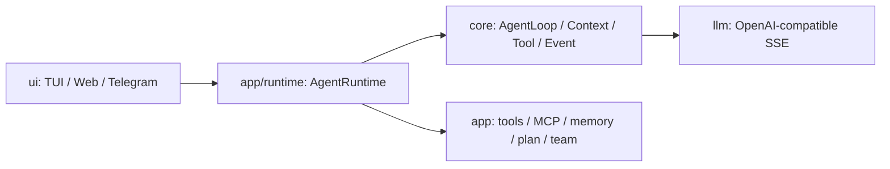

# AI README - Codex 项目上下文入口

## 项目总览

Aster 是一个教学版 Java Agent Runtime MVP，用于演示流式 LLM、AgentLoop、Tool Calling、上下文压缩、Session 持久化、HITL 工具审批、MCP、Skill、长期记忆、后台任务、TUI/Web/Telegram 多入口、固定 Agent Team 和动态 DAG Plan 的最小可运行架构。

## 生成信息

- 生成时间：2026-06-04 14:24
- 生成分支：master

## 快速导航

### AI 生成文档（generated/）

- [x] [项目结构](./generated/project-structure.md) - 目录树、模块划分；了解代码组织时使用 (2026-06-04 14:24)
- [x] [技术架构](./generated/architecture.md) - 分层架构、技术栈；了解技术选型时使用 (2026-06-04 14:24)
- [x] [开发指南](./generated/development-guide.md) - 环境搭建、构建/启动命令；上手时使用 (2026-06-04 14:24)
- [x] [核心流程](./generated/core-flows.md) - 主要业务调用链；理解系统时使用 (2026-06-04 14:24)

### 人工维护文档（manual/）

- [ ] [业务知识](./manual/business-knowledge.md) - 项目背景、领域术语、业务规则（人工 TODO）
- [ ] [历史经验](./manual/lessons-learned.md) - 踩坑记录；写代码前必读（人工 TODO）

## 使用建议

- 涉及架构、跨模块修改或不熟悉的目录时，先读 `generated/` 对应文档。
- 涉及业务术语、项目背景、历史坑点时，先读 `manual/`，其中 `<!-- TODO -->` 需要人工补充。
- 这些文档由代码和现有配置推断生成；不确定的内容不会写成事实。
