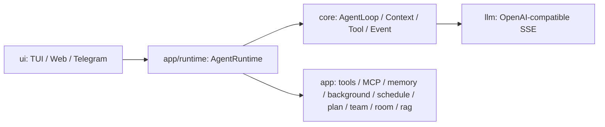

# AI README - Codex 项目上下文入口

## 项目总览

Aster 是一个教学版 Java Agent Runtime MVP，用于演示流式 LLM、AgentLoop、Tool Calling、上下文压缩、Session 持久化、HITL 工具审批、MCP、Skill、长期记忆、后台任务、自动化用户消息 schedule、TUI/Web/Telegram 多入口、固定 Agent Team、动态 DAG Plan、Web 多 Agent 聊天室、RAG 知识库问答、Web Chat 多模态图片理解和归档中心的最小可运行架构。

## 生成信息

- 生成时间：2026-06-04 14:24
- 生成分支：master
- 最近同步：2026-06-08，补充入口能力矩阵、Room、Archive、Web 多 session 并行 runtime、schedule/background 分离、LLM 上下文摘要、ContextWindow 快照、增量 JSONL 补齐、Web context 进度展示、主 Chat 模型切换、多 Agent 模型路由、Web 左栏底部 MCP/Skill 状态、Web Schedule 可视化、Web Todo/Schedule 折叠布局、Web 审批模式、Web 空启动规则、prompt 迁移规则、llm 层 text/embedding/speech/image/multimodal 能力拆分和 Ollama 配置入口，以及 Web Knowledge RAG 的上传、入库、检索和流式回答链路、Web Chat 图片理解分支

## 入口功能矩阵

| 功能 | TUI | Web | Telegram IM | 说明 |
| --- | --- | --- | --- | --- |
| 普通 Agent 对话 | 已实现 | 已实现 | 已实现 | 三个入口都通过 `AgentRuntime.submit()` 进入同一主链路。 |
| 流式响应展示 | 已实现 | 已实现 | 部分实现 | TUI/Web 展示 token 流；Telegram 缓存 token，最终一次性发送回答，避免刷屏。 |
| 图片理解 Chat | 未实现 | 已实现 | 未实现 | Web Chat 上传图片后走 Ollama 多模态 SSE；第一版不进入 AgentLoop、工具协议或普通 Session。 |
| 工具调用可视化 | 已实现 | 已实现 | 部分实现 | TUI/Web 展示工具状态；Web 合并调用和结果并支持折叠；Telegram 展示工具开始/完成，长内容截断。 |
| HITL 工具审批 | 已实现 | 已实现 | 已实现 | `/approve [id]`、`/deny [id] [reason]`；Web 使用审批块按钮，并提供“需要审批 / 默认通过”模式切换。 |
| 主 Chat 模型切换 | 已实现 | 已实现 | 已实现 | `/model [模型名]` 查看/切换；Web 顶部下拉切换当前 session runtime 的模型。Team 未指定模型时跟随当前 Chat 模型。 |
| `/stop` 停止 | 已实现 | 已实现 | 已实现 | 停止普通 run、取消审批、取消待执行 Plan；Room 同步回复当前还不是完整可中断流。 |
| `/steer` 运行中引导 | 已实现 | API 已有，页面未展示 | 未实现 | TUI 有 `/steer` 命令；Web 有 `/api/steer`，当前页面没有入口；Telegram 未接命令。 |
| follow-up 排队 | 已实现 | 已实现 | 已实现 | 忙碌时普通输入进入 `AgentRunCoordinator` 队列。 |
| Session CRUD | 部分实现 | 已实现 | 部分实现 | TUI 支持 list/new/use/delete/current；Web 支持列表、新建、切换、重命名、归档、历史读取；Telegram 支持当前 session 和新建。 |
| 多 session 并行运行 | 未实现 | 已实现 | 已实现 | Web 用 `WebSessionRuntimePool` 保留每个 session 的 `AgentRuntime`，切换会话不打断旧会话；Telegram 每个 chat 也持有独立 runtime。 |
| Token/Context 状态 | 已实现 | 已实现 | 未实现 | TUI footer 和 Web 右栏展示；Web 额外显示自动压缩状态和上下文使用进度；Telegram 不展示指标面板。 |
| MCP/Skill 状态 | 未实现 | 已实现 | 未实现 | Web Chat 左栏底部用 `MCP` / `SKILL` 按钮展开 MCP server loaded/failed 状态和已扫描 Skill 列表。 |
| Todo 便签 | 通过工具可用 | 已实现 | 通过工具可用 | Web 有右侧便签 CRUD，新建表单和已有条目默认折叠；普通 Agent 可用 todo 工具；TUI/IM 没有专门面板。 |
| 后台任务通知 | 已实现 | 已实现 | 已实现 | 通过各入口的 `NotificationSink` 展示长期记忆抽取、Todo 扫描等通知。 |
| 自动化用户消息 schedule | 通过工具可用 | 已实现 | 通过工具可用 | Web 右栏可折叠新建每日/一次性/固定间隔 schedule；底层仍是 `schedule` 到点后向当前 session 提交 user 消息，不是后台 handler。 |
| `/team` 固定 DAG 探索 | 已实现 | 已实现 | 已实现 | 三个入口都能触发；支持 `/team --model deepseek-v4-pro <任务>`；Team 子 Agent 工具调用不展示，避免刷屏。 |
| `/plan` 动态 DAG | 已实现 | 已实现 | 已实现 | 支持 `/plan` 生成、`/start` 执行、`/plan cancel` 取消。 |
| Web 多 Agent 聊天室 | 未实现 | 已实现 | 未实现 | 只有 Web 有 Room 页面、房间 CRUD、成员管理、Agent CRUD、`@name`/`@all` 触发。 |
| Room Agent 配置管理 | 未实现 | 已实现 | 未实现 | Agent 的 name、role、model、alias、工具白名单、system prompt 在 Web 中维护；加入/移出聊天室由成员关系管理。 |
| RAG 知识库问答 | 未实现 | 已实现 | 未实现 | Web Knowledge 页面支持 RAG session、知识库、文档上传、Ollama embedding、向量召回和 DeepSeek SSE 流式回答。 |
| 归档中心 | 未实现 | 已实现 | 未实现 | Web Archive 页面集中恢复、单个物理删除或批量物理删除已归档 session、todo、room、room-agent。 |

## 快速导航

### AI 生成文档（generated/）

- [x] [项目结构](./generated/project-structure.md) - 目录树、模块划分；了解代码组织时使用 (2026-06-04 14:24)
- [x] [技术架构](./generated/architecture.md) - 分层架构、技术栈；了解技术选型时使用 (2026-06-04 14:24)
- [x] [开发指南](./generated/development-guide.md) - 环境搭建、构建/启动命令；上手时使用 (2026-06-04 14:24)
- [x] [核心流程](./generated/core-flows.md) - 主要业务调用链；理解系统时使用 (2026-06-04 14:24)

### AI 与人工共同维护文档（manual/）

- [ ] [业务知识](./manual/business-knowledge.md) - 项目背景、领域术语、业务规则；对话中形成的共识要持续沉淀
- [ ] [历史经验](./manual/lessons-learned.md) - 踩坑记录、设计取舍和修复经验；写代码前必读

## 使用建议

- 涉及架构、跨模块修改或不熟悉的目录时，先读 `generated/` 对应文档。
- 涉及业务术语、项目背景、历史坑点时，先读 `manual/`；用户和 AI 对话过程中形成的新规则、新取舍和踩坑经验，应同步沉淀到这里。
- 涉及代码改动、架构变化、功能新增、经验沉淀或用户指出文档过时时，交付前都要评估是否需要同步更新 `docs/ai-readme/`；不需要更新时在最终说明里写清楚原因。
- 这些文档由代码和现有配置推断生成；不确定的内容不会写成事实。
