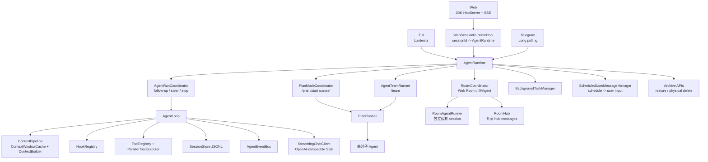
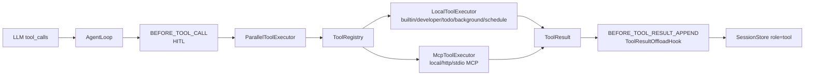
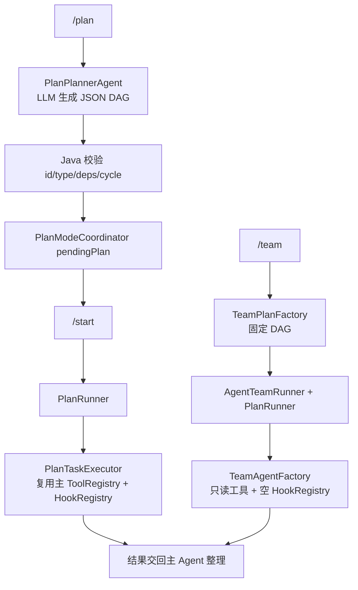
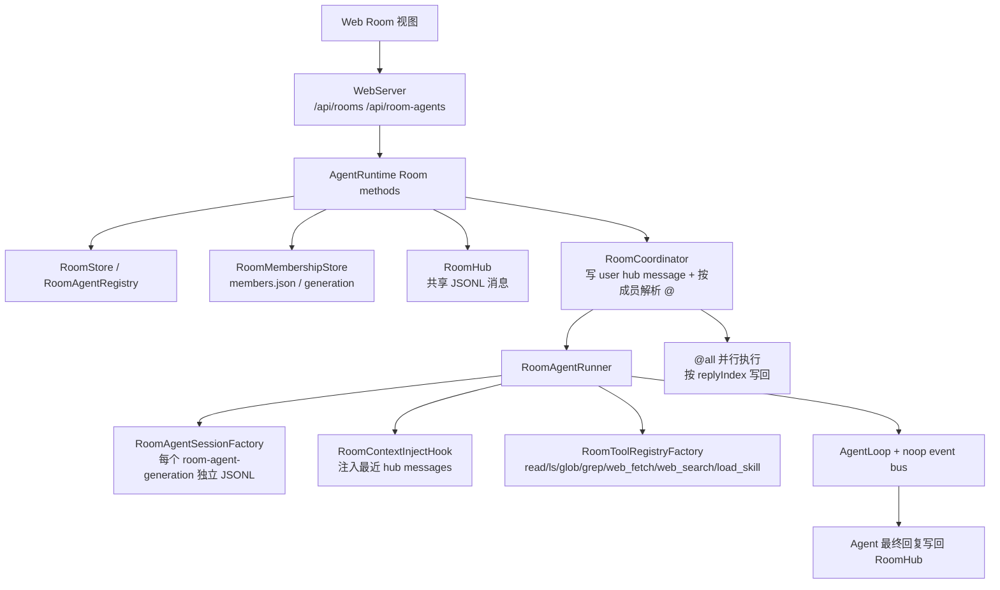
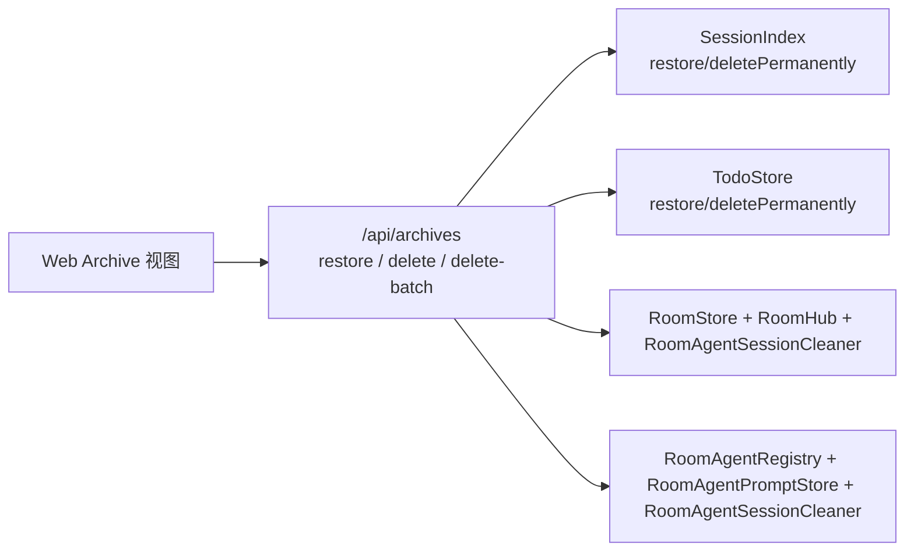

# 技术架构

<!-- AI生成，可根据团队规范更新 -->

## 架构总览



## 分层说明

| 分层 | 职责 | 主要类/文件 |
| --- | --- | --- |
| UI | 用户输入、事件渲染、命令分流 | `TuiMain`、`WebMain`、`WebSessionRuntimePool`、`TelegramMain`、`SlashCommandRegistry` |
| app/runtime | Runtime 创建、入口互斥、普通 run / Team / Plan / Room 调度 | `AgentRuntimeFactory`、`AgentRuntime`、`AgentRunCoordinator`、`PlanModeCoordinator` |
| app capabilities | 具体工具、MCP、Skill、Memory、HITL、Todo、Background、Schedule、Plan、Team、Room | `app/tool/*`、`app/mcp/*`、`app/memory/*`、`app/schedule/*`、`app/plan/*`、`app/team/*`、`app/room/*` |
| core | AgentLoop、Context、Tool、Hook、Event、Session、Stage 抽象 | `AgentLoop`、`ContextPipeline`、`ToolRegistry`、`HookRegistry`、`AgentEventBus` |
| llm | OpenAI-compatible provider 配置、请求、SSE 解析 | `OpenAiCompatibleChatClient`、`OpenAiCompatibleStreamParser`、`ProviderStreamEvent` |
| resources | Prompt 和 Web 静态资源 | `src/main/resources/prompts/`、`src/main/resources/web/` |

## 技术栈

| 类目 | 技术 | 版本 | 用途 |
| --- | --- | --- | --- |
| 语言/运行时 | Java | 21 | 主开发语言 |
| 构建工具 | Maven | 由 `pom.xml` 定义 | 构建、测试、运行 exec main |
| JSON | Jackson Databind | 2.17.2 | 配置、Session、Tool 参数、Web API、MCP JSON-RPC |
| HTTP | OkHttp | 4.12.0 | LLM SSE、Web fetch/search、Telegram API |
| TUI | Lanterna | 3.1.2 | 终端界面 |
| Web | JDK HttpServer | JDK 内置 | Web Chat、REST API、SSE |
| 测试 | JUnit 5 | 5.10.3 | 单元测试 |
| 测试 | MockWebServer | 4.12.0 | HTTP/LLM/Telegram 测试 |

## 关键架构决策

| 决策 | 当前实现 | 原因 |
| --- | --- | --- |
| 只保留流式 LLM 主路径 | `StreamingChatClient` + SSE parser | TUI/Web/Telegram 都消费流式事件，避免维护流式和非流式两套路径 |
| Context 压缩使用运行态窗口 | `ContextWindowCache` + `ContextPipeline` | 主 runtime 启动时恢复一次 JSONL，之后增量维护摘要和最近 turn，避免每轮请求全量 replay |
| 可选能力走 Hook / Extension | `HookRegistry`、`RuntimeExtensionRegistry` | 避免 `AgentLoop` 堆业务 if-else |
| Tool 统一抽象 | `ToolRegistry`、`ToolHandler`、`ToolResult` | 本地工具、MCP 工具、扩展工具统一给 LLM 暴露 |
| 高影响工具走 HITL | `ToolApprovalHook` 审批 `bash/write/edit` | 工具执行前可见、可拒绝，拒绝仍保持 tool_result 协议闭环 |
| Session 保存原始历史 | `JsonlSessionStore` | 压缩只影响请求，不污染可审计历史 |
| Web 普通 session 可并行运行 | `WebSessionRuntimePool` | 每个 session 保留独立 `AgentRuntime`，切换会话不关闭旧 runtime；SSE 事件按 `sessionName` 分流 |
| Background 与 Schedule 分离 | `BackgroundTaskManager` + `ScheduledUserMessageManager` | 后台任务处理系统维护和简单提醒；schedule 到点提交 user 消息，让 Agent 按普通链路执行 |
| Plan / Team 共用 DAG runner | `PlanRunner` | 复用依赖调度、并发执行、失败停止等逻辑 |
| Room 共享消息与私有上下文分离 | `RoomHub` + `RoomAgentSessionFactory` + `RoomContextInjectHook` | 后加入 Agent 能看到房间上下文，同时每个 Agent 保持独立历史 |
| 归档先软删再物理删除 | `SessionIndex`、`TodoStore`、`RoomStore`、`RoomAgentRegistry` | 普通删除保留审计；物理删除只允许已归档对象 |

## 事件流架构

```mermaid
sequenceDiagram
    participant Provider as LLM Provider
    participant Parser as OpenAiCompatibleStreamParser
    participant Loop as AgentLoop
    participant Bus as AgentEventBus
    participant UI as TUI/Web/Telegram

    Provider-->>Parser: SSE delta
    Parser-->>Loop: ProviderStreamEvent
    Loop-->>Bus: AgentEvent
    Bus-->>UI: AgentEventEnvelope
    UI-->>UI: 按入口渲染或聚合
```

## Tool 架构



## Plan / Team 架构



## Room 架构



## Archive 架构



## 当前边界

- Aster 是教学版 MVP，不是生产级多租户 Agent 平台。
- Web 前端当前使用静态资源和原生 JS，没有前端构建链路。
- Web 普通 Chat 支持多个 session runtime 并行；运行中 session 不能归档或物理删除，直到它空闲。
- Web Room 当前是同步 HTTP 回复，不是 token 流式聊天室；Room Agent 事件总线使用 noop，页面只展示最终回复。
- Room 当前只在 Web 入口实现；TUI 和 Telegram 没有 Room 页面或 Agent CRUD。
- Room `@all` 只触发当前聊天室成员。Agent 并行执行，回复按成员顺序写回，避免完成时间影响消息顺序。
- Archive Center 当前只在 Web 入口实现，集中处理已归档 session、todo、room、room-agent，并支持批量物理删除。
- 长期记忆当前是 Markdown 存储，不是向量检索系统。
- 后台任务当前只支持明确 handler，例如 `reminder`、`todo_scan`、`memory_extract`；需要 Agent 到点自动执行的任务使用 `schedule` 提交 user 消息。
- `schedule` 是每个 `AgentRuntime` 绑定当前 session 的自动化用户消息调度器，应用不运行时不会主动执行。
- Team 当前是只读探索；会修改文件的是普通 Agent 或 Plan 子 Agent，并且高影响工具需要 HITL。
