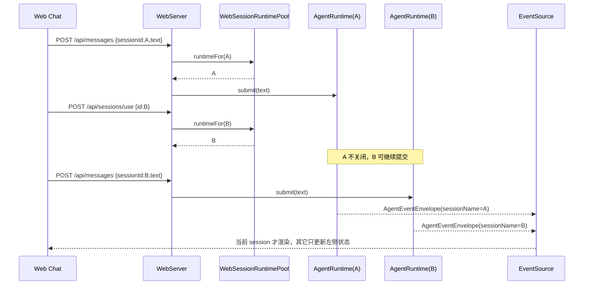
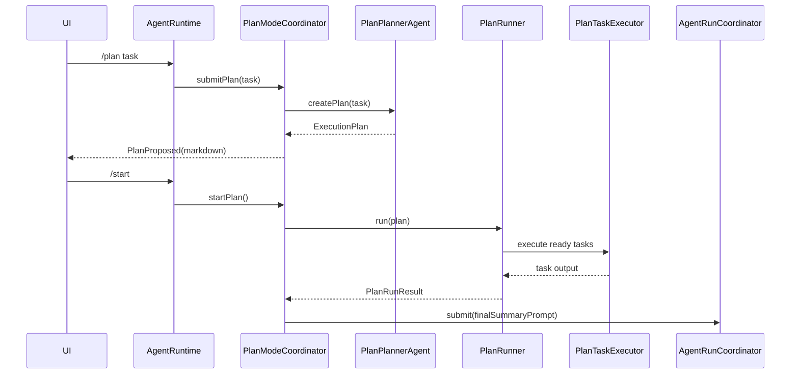
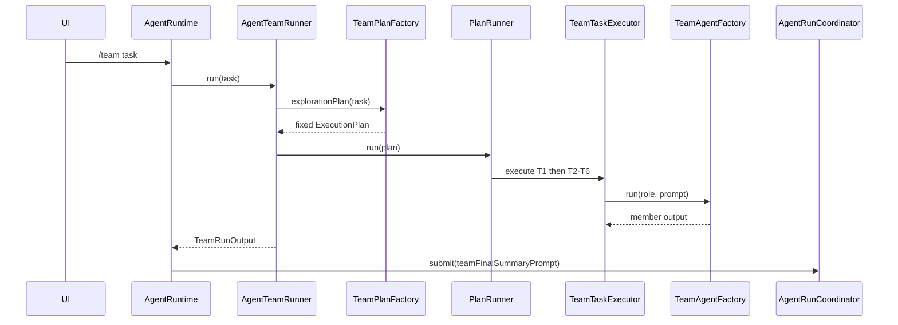
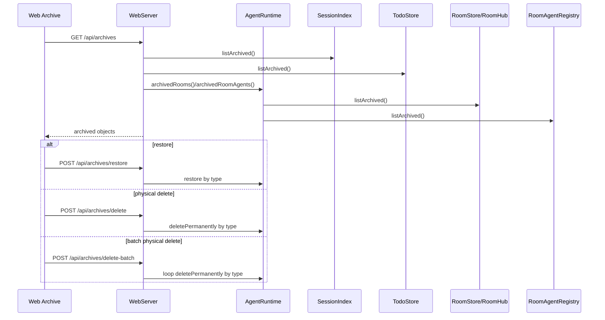

# 核心流程

<!-- AI生成，可根据团队规范更新 -->

> 提示：以下流程由 AI 从代码推断而来，请用户确认 P0/P1 是否就是团队认知中的核心。

## 流程清单

| 优先级 | 流程名 | 入口 | 备注 |
| --- | --- | --- | --- |
| P0 | 普通 Agent Run | `AgentRuntime.submit()` / `AgentLoop.run()` | 主对话、工具调用和最终回答 |
| P0 | Tool Calling + HITL | `AgentLoop.executeToolCalls()`、`ToolApprovalHook` | 保护 `bash/write/edit`，保持 tool 协议闭环 |
| P0 | Context 构建和 `<system-reminder>` 注入 | `ContextPipeline.build()`、`SystemReminderInjectHook` | 压缩旧对话、注入时间/记忆/Skill |
| P0 | 动态 `/plan` | `AgentRuntime.submitPlan()`、`PlanModeCoordinator` | LLM 生成 DAG，用户 `/start` 执行 |
| P1 | 固定 `/team` | `AgentRuntime.submitTeam()`、`AgentTeamRunner` | 只读并行探索，结果交主 Agent |
| P1 | 后台任务 | `BackgroundTaskScheduler` | reminder、todo_scan、memory_extract |
| P1 | 自动化用户消息 schedule | `ScheduledUserMessageScheduler` | 到点后向当前 session 提交 user 消息，复用普通 Agent 链路 |
| P1 | 多入口事件消费 | TUI / Web / Telegram event handlers | 同一 AgentEvent，不同展示策略 |
| P1 | Web 多 session 并行运行 | `WebSessionRuntimePool`、`WebAgentEventMapper`、`app.js` | Web 切换 B 不停止 A；SSE 按 sessionName 分流 |
| P1 | Web Room 多 Agent 聊天 | `AgentRuntime.sendRoomMessage()`、`RoomCoordinator` | Web 独有；成员关系 + 共享 hub message + Agent 私有上下文 |
| P1 | 归档中心 | `WebServer.handleArchives()` | Web 独有；恢复、单个物理删除或批量物理删除已归档对象 |

## 流程 1：普通 Agent Run

```mermaid
sequenceDiagram
    participant UI as UI入口
    participant Runtime as AgentRuntime
    participant Coordinator as AgentRunCoordinator
    participant Loop as AgentLoop
    participant Context as ContextPipeline / ContextWindowCache
    participant LLM as StreamingChatClient
    participant Tools as ParallelToolExecutor
    participant Session as SessionStore

    UI->>Runtime: submit(userInput)
    Runtime->>Coordinator: submit(userInput)
    Coordinator->>Loop: run(userInput, control)
    Loop->>Session: append(user)
    Loop->>Context: build()
    Context-->>Loop: ContextBuildResult
    Loop->>LLM: stream(ChatRequest)
    LLM-->>Loop: ProviderStreamEvent*
    alt no tool_calls
        Loop->>Session: recordRunFinished(answer)
        Loop-->>UI: AgentEvent RunFinished
    else has tool_calls
        Loop->>Session: append(assistant tool_calls)
        Loop->>Tools: execute(tool_calls)
        Tools-->>Loop: ToolResult*
        Loop->>Session: append(role=tool)
        Loop->>LLM: next round
    end
```

### 调用链

1. `ui/*` 入口解析输入。
2. `app/runtime/AgentRuntime.submit`
3. `app/runtime/AgentRunCoordinator.submit`
4. `core/agent/AgentLoop.run`
5. `core/context/ContextPipeline.build`
6. `llm/StreamingChatClient.stream`
7. `core/tool/ParallelToolExecutor`
8. `core/session/SessionStore`

### 关键分支

- 忙碌时普通输入进入 follow-up queue，并发布 `RunQueued`。
- `/stop` 设置当前 `AgentRunControl.stopRequested`，AgentLoop 在安全点停止。
- `/steer` 写入当前控制信号，请求前 Hook 负责消费。
- 工具轮数上限来自 `AgentRuntimeFactory.MAX_TOOL_ROUNDS = 100`。

## 流程 1.1：Web 多 session 并行运行



### 关键分支

- Web 的普通消息、`/stop`、`/steer`、HITL 审批都带 `sessionId`，后端按 session 找对应 runtime。
- 切换 session 只更新 `currentSessionId` 并确保目标 runtime 存在，不关闭旧 runtime。
- 运行中 session 归档或物理删除会返回 409，避免关闭仍在执行的 runtime。
- 前端收到 SSE 后必须使用 `meta.sessionName` 判断是否渲染到当前窗口；非当前 session 只更新 running/queued/approval 状态。

## 流程 2：Context 窗口快照、LLM 摘要和 `<system-reminder>`

```mermaid
sequenceDiagram
    participant Runtime as AgentRuntimeFactory
    participant Jsonl as JsonlSessionStore
    participant Snapshot as ContextWindowSnapshotStore
    participant Loop as AgentLoop
    participant Pipeline as ContextPipeline
    participant Cache as ContextWindowCache
    participant Store as ContextWindowSnapshotSessionStore
    participant Summarizer as LlmSummarizer
    participant Hook as SystemReminderInjectHook
    participant LLM as StreamingChatClient

    Runtime->>Snapshot: load(sessionId, branch)
    alt snapshot valid
        Runtime->>Jsonl: containsEvent(lastSeq,lastHash)
        Runtime->>Jsonl: loadMessageRecordsAfter(lastSeq)
        Runtime->>Cache: restore(bootstrap, snapshot)
        Runtime->>Cache: append records after lastSeq
    else no snapshot or invalid
        Runtime->>Jsonl: replay() -> records(seq/hash/message)
        Runtime->>Cache: initialize(bootstrap, records)
        Cache->>Summarizer: summarize(old turns) when trim
        Summarizer->>LLM: stream(summary request without tools)
    end
    Runtime->>Snapshot: save current snapshot
    Loop->>Store: append(user / assistant / tool)
    Store-->>Cache: append 成功后增量更新 window
    Store-->>Snapshot: overwrite snapshot(lastSeq,lastHash)
    Loop->>Pipeline: build()
    Pipeline->>Cache: build()
    Cache-->>Pipeline: recent turns + runningSummary
    Pipeline-->>Loop: ContextBuildResult
    Loop->>Hook: BEFORE_LLM_REQUEST
    Hook-->>Loop: last user prepended with <system-reminder>
    Loop->>LLM: request messages
```

### 调用链

1. `app/runtime/AgentRuntimeFactory.restoreOrBuildContextWindowCache`
2. `core/session/JsonlSessionStore.replay`
3. `app/runtime/JsonContextWindowSnapshotStore.load/save`
4. `core/context/ContextWindowCache.restore/initialize/append/build`
5. `app/runtime/ContextWindowSnapshotSessionStore.append`
6. `core/context/LlmSummarizer.summarize`
7. `core/context/ToolProtocolValidator`
8. `app/extension/SystemReminderInjectHook`
9. `app/memory/MemoryPromptRenderer`
10. `app/skill/SkillIndexRenderer`

### 关键分支

- JSONL session 仍是事实源；`workspace/context-windows/*.json` 是可覆盖缓存，用来保存上一轮压缩进度。
- 主 runtime 启动时先读取 snapshot；snapshot 元信息有效后，用 `containsEvent(lastSeq,lastHash)` 校验它仍对得上 JSONL。
- snapshot 有效时直接恢复 `runningSummary + recentTurns`，并用 `loadMessageRecordsAfter(lastSeq)` 只读取和追加新增 JSONL 消息；snapshot 缺失、损坏、prompt/摘要器变化或 seq/hash 对不上时才 full replay 全量重建窗口。
- 主 Chat 模型切换不让 snapshot 失效；模型是 `AgentRuntime` 的运行态，下一次 LLM 请求才读取新模型。
- 每条消息 append 成功后，`ContextWindowSnapshotSessionStore` 先写 JSONL，再更新 `ContextWindowCache`，最后覆盖保存最新 snapshot。
- 触发压缩时优先用 `LlmSummarizer` 请求流式 LLM 生成语义摘要；摘要请求不带 tools、不带 thinking，不写 session，失败时回退 `TranscriptSummarizer`。
- 压缩按 user turn，而不是字符串硬切。
- 内存窗口只保留 `runningSummary + 最近完整 turn`，完整原始历史仍在 `SessionStore`。
- 当前时间、时区、长期记忆、Skill 索引和旧对话摘要只进入本轮 request messages。
- 压缩摘要不写回 `SessionStore`。
- Web 右栏通过 `ContextBuilt` 事件展示自动压缩状态、before/after/max 和当前上下文使用比例。

## 流程 3：Tool Calling + HITL

```mermaid
sequenceDiagram
    participant Loop as AgentLoop
    participant Hook as ToolApprovalHook
    participant UI as TUI/Web/Telegram
    participant Exec as ParallelToolExecutor
    participant Offload as ToolResultOffloadHook
    participant Session as SessionStore

    Loop->>Hook: BEFORE_TOOL_CALL(toolCall)
    alt bash/write/edit
        Hook->>UI: ToolApprovalRequested
        UI->>Hook: approve/deny
    end
    alt approved or no approval needed
        Loop->>Exec: execute tool
        Exec-->>Loop: ToolResult
    else denied
        Hook-->>Loop: ToolHookDecision.deny
    end
    Loop->>Offload: BEFORE_TOOL_RESULT_APPEND
    Offload-->>Loop: compact/offloaded ToolResult
    Loop->>Session: append role=tool
```

### 调用链

1. `core/agent/AgentLoop`
2. `core/hook/HookRegistry`
3. `app/hitl/ToolApprovalHook`
4. `app/hitl/ToolApprovalManager`
5. `core/tool/ParallelToolExecutor`
6. `app/tool/result/ToolResultOffloadHook`
7. `core/session/SessionStore.append`

### 关键分支

- 审批拒绝也要生成 tool 错误结果，不能破坏 tool_call/tool_result 协议。
- `/approve` 或 `/deny` 不带 id 表示处理全部待审批工具。
- `/stop` 会取消待审批工具，避免 run 永久阻塞。
- 大工具结果会卸载到 `workspace/artifacts/tool-results/*.jsonl`。

## 流程 4：动态 `/plan`



### 调用链

1. `ui/*` `/plan` 命令
2. `app/runtime/AgentRuntime.submitPlan`
3. `app/runtime/PlanModeCoordinator.submitPlan`
4. `app/plan/PlanPlannerAgent.createPlan`
5. `app/plan/PlanPlannerAgent.parsePlan`
6. `app/runtime/PlanModeCoordinator.startPlan`
7. `app/plan/PlanRunner.run`
8. `app/plan/PlanTaskExecutor.execute`
9. `app/runtime/AgentRunCoordinator.submit`

### 关键分支

- `/plan` 只生成 DAG，不立即执行。
- Java 侧校验任务 id、type、dependencies、自依赖和环。
- `FILE_WRITE` 和 `COMMAND` 节点走 `writeLock` 串行。
- `PlanModeCoordinator.version` 防止取消或重新计划后的旧异步结果污染状态。
- Plan 子 Agent 复用主 `ToolRegistry` 和 `HookRegistry`，所以写操作仍走 HITL。

## 流程 5：固定 `/team`



### 调用链

1. `ui/*` `/team` 命令
2. `app/runtime/AgentRuntime.submitTeam`
3. `app/team/AgentTeamRunner.run`
4. `app/team/TeamPlanFactory.explorationPlan`
5. `app/plan/PlanRunner.run`
6. `app/team/TeamTaskExecutor.execute`
7. `app/team/TeamAgentFactory.run`
8. `app/runtime/AgentRunCoordinator.submit`

### 关键分支

- Team 是固定 DAG：T1 planner，T2/T3/T4 code researcher，T5/T6 risk reviewer。
- Team 子 Agent 只注册 `read`、`ls`、`glob`、`grep`、`web_fetch`、`web_search`。
- Team 使用空 `HookRegistry`，不注册写工具、bash、todo、background_task、schedule 或 subagent。
- Team 子 Agent 工具事件不转发 UI，只转发成员 token，避免 read/grep 刷屏。

## 流程 6：后台任务


### 调用链

1. `app/tool/background/BackgroundTaskTool`
2. `app/background/BackgroundTaskManager`
3. `app/background/BackgroundTaskScheduler`
4. `app/background/BackgroundTaskExecutor`
5. `app/background/BackgroundTaskHandler`
6. `app/notification/NotificationSink`

### 关键分支

- 当前 handler 包括 `reminder`、`todo_scan`、`memory_extract`。
- `todo_scan` 由 runtime 启动时确保存在。
- `background_task` 不负责让 Agent 到点自动执行任务；它只处理明确 handler 对应的系统后台动作和简单提醒。
- 后台任务扫描间隔由 `BACKGROUND_TASK_SCAN_INTERVAL_SECONDS` 控制，旧 `SCHEDULE_INTERVAL_SECONDS` 只作为兼容 fallback。

## 流程 6.1：自动化用户消息 schedule

```mermaid
sequenceDiagram
    participant Tool as schedule tool
    participant Manager as ScheduledUserMessageManager
    participant Store as schedules.json
    participant Scheduler as ScheduledUserMessageScheduler
    participant Runtime as AgentRunCoordinator
    participant Loop as AgentLoop

    Tool->>Manager: create/list/cancel
    Manager->>Store: write schedule
    Manager->>Scheduler: reschedule()
    Scheduler->>Store: find nearest nextRunAt
    Scheduler->>Scheduler: sleep until nextRunAt
    Scheduler->>Runtime: submit(rendered user input)
    Runtime->>Loop: run(userInput, control)
    Scheduler->>Store: complete/reschedule/failed
```

### 调用链

1. `app/tool/schedule/ScheduleTool`
2. `app/schedule/ScheduledUserMessageManager`
3. `app/schedule/JsonScheduledUserMessageStore`
4. `app/schedule/ScheduledUserMessageScheduler`
5. `app/runtime/AgentRunCoordinator.submit`
6. `core/agent/AgentLoop.run`

### 关键分支

- `schedule` 管理的是“到点提交 user 消息”，不是后台 handler。
- 到点后照常走普通 Agent 链路，所以仍能使用工具、HITL、Session、Event 和上下文注入。
- 一次性 `once/delay` 执行后标记 completed；`interval/daily` 执行后计算下一次 `nextRunAt`。
- 派发失败会把 schedule 标记为 failed，避免已到期任务反复立即触发。
- 当前 schedule 绑定创建它的 `AgentRuntime` session；应用未运行时不会主动执行。

## 流程 7：Web Room 多 Agent 聊天

```mermaid
sequenceDiagram
    participant Web as Web Room
    participant Runtime as AgentRuntime
    participant Coord as RoomCoordinator
    participant Members as RoomMembershipStore
    participant Hub as RoomHub
    participant Parser as RoomMentionParser
    participant Runner as RoomAgentRunner
    participant Hook as RoomContextInjectHook
    participant Loop as AgentLoop

    Web->>Runtime: sendRoomMessage(roomId, text)
    Runtime->>Coord: send(roomId, text)
    Coord->>Hub: publish user hub message
    Coord->>Members: list active members by orderIndex
    Coord->>Parser: parse @name/@alias/@all in room members
    par mentioned agents
        Coord->>Runner: run(room, agent, triggerMessage)
        Runner->>Hook: 注入最近 hub messages
        Runner->>Loop: run(triggerMessage.content)
        Loop-->>Runner: final answer
        Runner-->>Coord: answer
    end
    Coord->>Coord: sort by replyIndex
    loop ordered replies
        Coord->>Hub: publish agent final reply
    end
    Coord-->>Web: emitted hub messages
```

### 调用链

1. `src/main/resources/web/assets/app.js` Room 视图提交消息。
2. `ui/web/WebServer.handleRoomMessages`
3. `app/runtime/AgentRuntime.sendRoomMessage`
4. `app/room/RoomCoordinator.send`
5. `app/room/RoomMembershipStore`
6. `app/room/RoomHub.publish`
7. `app/room/RoomMentionParser.parse`
8. `app/room/RoomAgentRunner.run`
9. `core/agent/AgentLoop.run`

### 关键分支

- 房间第一条用户消息会补成房间 topic 的默认来源。
- 未命中 `@name`、`@alias` 或 `@all` 时，只写入用户 hub message，不触发 Agent。
- `@all` 只触发当前聊天室未归档成员，不触发全局所有 Agent。
- Agent 并行执行；全部完成后按成员 `orderIndex` 派生的 `replyIndex` 写回 hub message。
- Room Agent 的工具注册表由 `RoomToolRegistryFactory` 限制，只开放只读/检索类工具。
- Room Agent 使用独立 JSONL session；成员移除再恢复会递增 generation 并打开新的私有 session。
- 共享房间消息通过 `RoomContextInjectHook` 临时注入，不写入私有 session。
- Room Agent 事件总线是 noop，Web Room 只展示最终回复，不展示 token、reasoning、工具调用或工具结果。
- 当前 Room 回复是同步 HTTP 请求，不是 SSE/WebSocket 流式聊天室。

## 流程 8：归档中心



### 调用链

1. `src/main/resources/web/assets/app.js` Archive 视图。
2. `ui/web/WebServer.handleArchives`
3. `core/session/SessionIndex`
4. `app/todo/TodoStore`
5. `app/runtime/AgentRuntime` Room/Room Agent archive 方法。
6. `app/room/RoomStore`、`RoomHub`、`RoomAgentRegistry`、`RoomAgentPromptStore`、`RoomAgentSessionCleaner`

### 关键分支

- Archive 只展示已归档对象；普通 active 对象不在这里物理删除。
- 批量物理删除使用同一套删除逻辑，只是把多个 `{type,id}` 一次提交。
- session 物理删除会删除索引记录和对应 JSONL。
- todo 物理删除会从 JSON 状态文件中移除。
- room 物理删除会删除房间记录、hub messages 和该 room 下的 Agent 私有 session。
- room-agent 物理删除会删除 Agent 配置、外部 prompt 和相关私有 session。
