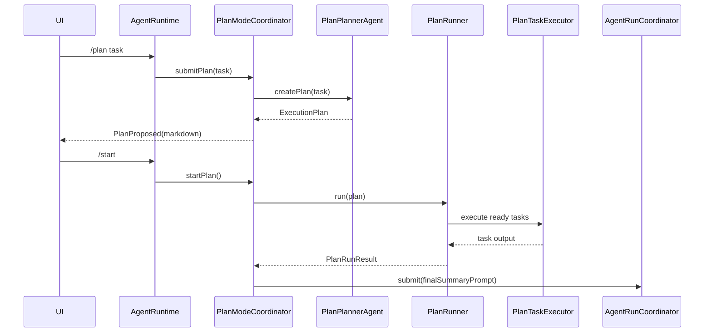
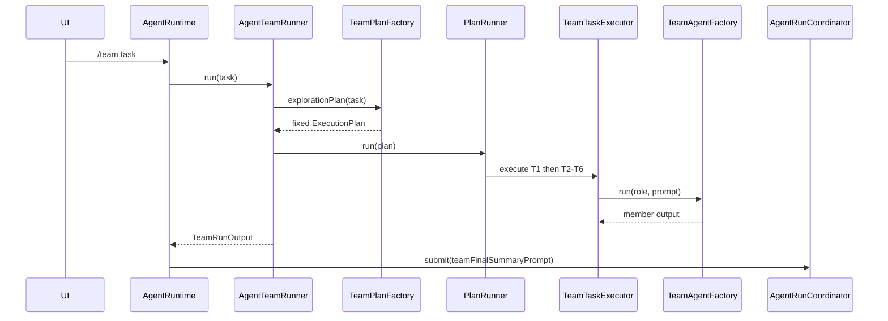
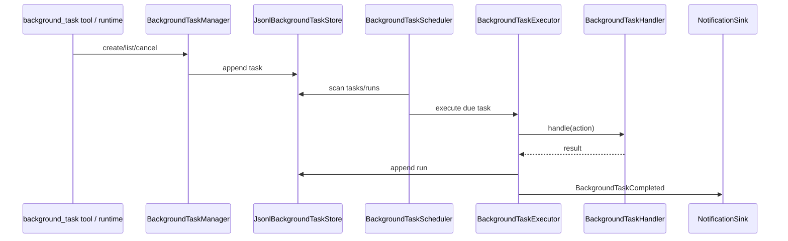

# 核心流程

<!-- AI生成，可根据团队规范更新 -->

> 提示：以下流程由 AI 从代码推断而来，请用户确认 P0/P1 是否就是团队认知中的核心。

## 流程清单

| 优先级 | 流程名 | 入口 | 备注 |
| --- | --- | --- | --- |
| P0 | 普通 Agent Run | `AgentRuntime.submit()` / `AgentLoop.run()` | 主对话、工具调用和最终回答 |
| P0 | Tool Calling + HITL | `AgentLoop.executeToolCalls()`、`ToolApprovalHook` | 保护 `bash/write/edit`，保持 tool 协议闭环 |
| P0 | Context 构建和 `<system-reminder>` 注入 | `ContextPipeline.build()`、`SystemReminderInjectHook` | 压缩旧对话、注入时间/记忆/Skill |
| P0 | 动态 `/plan` | `AgentRuntime.submitPlan()`、`PlanModeCoordinator` | LLM 生成 DAG，用户 `/start` 执行 |
| P1 | 固定 `/team` | `AgentRuntime.submitTeam()`、`AgentTeamRunner` | 只读并行探索，结果交主 Agent |
| P1 | 后台任务 | `BackgroundTaskScheduler` | reminder、todo_scan、memory_extract |
| P1 | 多入口事件消费 | TUI / Web / Telegram event handlers | 同一 AgentEvent，不同展示策略 |

## 流程 1：普通 Agent Run

```mermaid
sequenceDiagram
    participant UI as UI入口
    participant Runtime as AgentRuntime
    participant Coordinator as AgentRunCoordinator
    participant Loop as AgentLoop
    participant Context as ContextPipeline
    participant LLM as StreamingChatClient
    participant Tools as ParallelToolExecutor
    participant Session as SessionStore

    UI->>Runtime: submit(userInput)
    Runtime->>Coordinator: submit(userInput)
    Coordinator->>Loop: run(userInput, control)
    Loop->>Session: append(user)
    Loop->>Context: build()
    Context-->>Loop: ContextBuildResult
    Loop->>LLM: stream(ChatRequest)
    LLM-->>Loop: ProviderStreamEvent*
    alt no tool_calls
        Loop->>Session: recordRunFinished(answer)
        Loop-->>UI: AgentEvent RunFinished
    else has tool_calls
        Loop->>Session: append(assistant tool_calls)
        Loop->>Tools: execute(tool_calls)
        Tools-->>Loop: ToolResult*
        Loop->>Session: append(role=tool)
        Loop->>LLM: next round
    end
```

### 调用链

1. `ui/*` 入口解析输入。
2. `app/runtime/AgentRuntime.submit`
3. `app/runtime/AgentRunCoordinator.submit`
4. `core/agent/AgentLoop.run`
5. `core/context/ContextPipeline.build`
6. `llm/StreamingChatClient.stream`
7. `core/tool/ParallelToolExecutor`
8. `core/session/SessionStore`

### 关键分支

- 忙碌时普通输入进入 follow-up queue，并发布 `RunQueued`。
- `/stop` 设置当前 `AgentRunControl.stopRequested`，AgentLoop 在安全点停止。
- `/steer` 写入当前控制信号，请求前 Hook 负责消费。
- 工具轮数上限来自 `AgentRuntimeFactory.MAX_TOOL_ROUNDS = 100`。

## 流程 2：Context 构建和 `<system-reminder>`

```mermaid
sequenceDiagram
    participant Loop as AgentLoop
    participant Pipeline as ContextPipeline
    participant Stage as ContextCompressionStage
    participant Hook as SystemReminderInjectHook
    participant LLM as StreamingChatClient

    Loop->>Pipeline: build()
    Pipeline->>Stage: LoadSession + Compress
    Stage-->>Pipeline: messages + summary
    Pipeline-->>Loop: ContextBuildResult
    Loop->>Hook: BEFORE_LLM_REQUEST
    Hook-->>Loop: last user prepended with <system-reminder>
    Loop->>LLM: request messages
```

### 调用链

1. `core/context/ContextPipeline.build`
2. `core/stage/LoadSessionMessagesStage`
3. `core/stage/ContextCompressionStage`
4. `core/context/ToolProtocolValidator`
5. `app/extension/SystemReminderInjectHook`
6. `app/memory/MemoryPromptRenderer`
7. `app/skill/SkillIndexRenderer`

### 关键分支

- 压缩按 user turn，而不是字符串硬切。
- 当前时间、时区、长期记忆、Skill 索引和旧对话摘要只进入本轮 request messages。
- 压缩摘要不写回 `SessionStore`。

## 流程 3：Tool Calling + HITL

```mermaid
sequenceDiagram
    participant Loop as AgentLoop
    participant Hook as ToolApprovalHook
    participant UI as TUI/Web/Telegram
    participant Exec as ParallelToolExecutor
    participant Offload as ToolResultOffloadHook
    participant Session as SessionStore

    Loop->>Hook: BEFORE_TOOL_CALL(toolCall)
    alt bash/write/edit
        Hook->>UI: ToolApprovalRequested
        UI->>Hook: approve/deny
    end
    alt approved or no approval needed
        Loop->>Exec: execute tool
        Exec-->>Loop: ToolResult
    else denied
        Hook-->>Loop: ToolHookDecision.deny
    end
    Loop->>Offload: BEFORE_TOOL_RESULT_APPEND
    Offload-->>Loop: compact/offloaded ToolResult
    Loop->>Session: append role=tool
```

### 调用链

1. `core/agent/AgentLoop`
2. `core/hook/HookRegistry`
3. `app/hitl/ToolApprovalHook`
4. `app/hitl/ToolApprovalManager`
5. `core/tool/ParallelToolExecutor`
6. `app/tool/result/ToolResultOffloadHook`
7. `core/session/SessionStore.append`

### 关键分支

- 审批拒绝也要生成 tool 错误结果，不能破坏 tool_call/tool_result 协议。
- `/approve` 或 `/deny` 不带 id 表示处理全部待审批工具。
- `/stop` 会取消待审批工具，避免 run 永久阻塞。
- 大工具结果会卸载到 `workspace/artifacts/tool-results/*.jsonl`。

## 流程 4：动态 `/plan`



### 调用链

1. `ui/*` `/plan` 命令
2. `app/runtime/AgentRuntime.submitPlan`
3. `app/runtime/PlanModeCoordinator.submitPlan`
4. `app/plan/PlanPlannerAgent.createPlan`
5. `app/plan/PlanPlannerAgent.parsePlan`
6. `app/runtime/PlanModeCoordinator.startPlan`
7. `app/plan/PlanRunner.run`
8. `app/plan/PlanTaskExecutor.execute`
9. `app/runtime/AgentRunCoordinator.submit`

### 关键分支

- `/plan` 只生成 DAG，不立即执行。
- Java 侧校验任务 id、type、dependencies、自依赖和环。
- `FILE_WRITE` 和 `COMMAND` 节点走 `writeLock` 串行。
- `PlanModeCoordinator.version` 防止取消或重新计划后的旧异步结果污染状态。
- Plan 子 Agent 复用主 `ToolRegistry` 和 `HookRegistry`，所以写操作仍走 HITL。

## 流程 5：固定 `/team`



### 调用链

1. `ui/*` `/team` 命令
2. `app/runtime/AgentRuntime.submitTeam`
3. `app/team/AgentTeamRunner.run`
4. `app/team/TeamPlanFactory.explorationPlan`
5. `app/plan/PlanRunner.run`
6. `app/team/TeamTaskExecutor.execute`
7. `app/team/TeamAgentFactory.run`
8. `app/runtime/AgentRunCoordinator.submit`

### 关键分支

- Team 是固定 DAG：T1 planner，T2/T3/T4 code researcher，T5/T6 risk reviewer。
- Team 子 Agent 只注册 `read`、`ls`、`glob`、`grep`、`web_fetch`、`web_search`。
- Team 使用空 `HookRegistry`，不注册写工具、bash、todo、background_task 或 subagent。
- Team 子 Agent 工具事件不转发 UI，只转发成员 token，避免 read/grep 刷屏。

## 流程 6：后台任务



### 调用链

1. `app/tool/background/BackgroundTaskTool`
2. `app/background/BackgroundTaskManager`
3. `app/background/BackgroundTaskScheduler`
4. `app/background/BackgroundTaskExecutor`
5. `app/background/BackgroundTaskHandler`
6. `app/notification/NotificationSink`

### 关键分支

- 当前 handler 包括 `reminder`、`todo_scan`、`memory_extract`。
- `todo_scan` 由 runtime 启动时确保存在。
- 不支持任意到点自动运行 Agent；复杂定时 Agent 任务需要新增明确 handler。
