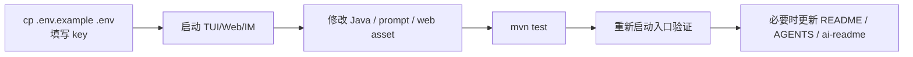

# 开发指南

<!-- AI生成，可根据团队规范更新 -->

## 环境准备

| 工具 | 版本 |
| --- | --- |
| Java | 21 |
| Maven | 使用本机 Maven；项目 `pom.xml` 配置 `maven.compiler.release=21` |
| 模型 API Key | `DEEPSEEK_API_KEY` 或 `OPENAI_COMPATIBLE_API_KEY` |

## 常用命令

| 操作 | 命令 |
| --- | --- |
| 复制环境变量示例 | `cp .env.example .env` |
| 启动 TUI | `./aster2tui` |
| 启动 Web | `./aster2web` |
| 启动 Telegram IM | `./aster2im` |
| Maven 启动默认 TUI | `mvn -q exec:java` |
| Maven 启动 Web | `mvn -q -Dexec.mainClass=com.aster.ui.web.WebMain exec:java` |
| Maven 启动 Telegram | `mvn -q -Dexec.mainClass=com.aster.ui.im.telegram.TelegramMain exec:java` |
| 运行测试 | `mvn test` |
| 构建打包 | `mvn package` |

## 配置文件清单

| 文件 | 作用 |
| --- | --- |
| `.env.example` | 本地环境变量示例 |
| `.env` | 本地真实密钥和端口配置；不要提交 |
| `pom.xml` | Java 21、依赖、Maven 插件配置 |
| `src/main/resources/prompts/agent/system.md` | 主 Agent system prompt |
| `src/main/resources/prompts/context/summary.md` | 上下文摘要 prompt |
| `src/main/resources/prompts/memory/*.md` | 长期记忆抽取和注入 prompt |
| `src/main/resources/prompts/plan/*.md` | 动态 Plan prompt |
| `src/main/resources/prompts/team/*.md` | Agent Team prompt |
| `src/main/resources/web/index.html` | Web 页面 |
| `src/main/resources/web/assets/app.js` | Web 前端逻辑 |
| `src/main/resources/web/assets/app.css` | Web 样式 |
| `workspace/mcp.json` | MCP 配置；运行时本地文件，不提交 |

## 关键环境变量

| 变量 | 作用 |
| --- | --- |
| `DEEPSEEK_API_KEY` | 默认 DeepSeek API Key |
| `OPENAI_COMPATIBLE_PROVIDER` | 覆盖 OpenAI-compatible provider 名称 |
| `OPENAI_COMPATIBLE_BASE_URL` | 覆盖模型 API base URL |
| `OPENAI_COMPATIBLE_API_KEY` | 覆盖模型 API key |
| `OPENAI_COMPATIBLE_MODEL` | 覆盖模型名 |
| `ASTER_WEB_PORT` | Web 端口，`aster2web` 默认 8081 |
| `ASTER_SESSION` | Web 启动 session 名称 |
| `TELEGRAM_BOT_TOKEN` | Telegram Bot token |
| `TELEGRAM_ALLOWED_CHAT_IDS` | Telegram chat 白名单，逗号分隔 |
| `OWNER_ID` | `aster2im` 兼容变量，可转换为 Telegram 白名单 |
| `TAVILY_API_KEY` | `web_search` 工具使用 |
| `SCHEDULE_INTERVAL_SECONDS` | 后台任务扫描间隔，默认 10 秒 |

## 开发循环



## 调试与验证

### Web

- 默认入口：`http://localhost:8081`
- 默认脚本：`./aster2web`
- 如果端口被占用，`aster2web` 会打印占用进程，并提示：
  - `screen -S aster2web -X quit`
  - `ASTER_WEB_PORT=8082 ./aster2web`

### TUI

- 默认入口：`./aster2tui`
- 常用命令：
  - `/session ...`
  - `/steer <message>`
  - `/stop`
  - `/team <任务>`
  - `/plan <任务>`
  - `/start`
  - `/approve [id]`
  - `/deny [id] [reason]`

### Telegram

- 默认入口：`./aster2im`
- 需要 `.env` 中配置 `TELEGRAM_BOT_TOKEN` 和 `TELEGRAM_ALLOWED_CHAT_IDS`。
- 如果只配置 `OWNER_ID`，脚本会把它转换为 `TELEGRAM_ALLOWED_CHAT_IDS`。

### Runtime 数据

```text
workspace/
├── sessions/                 # Session JSONL 和 index.json
├── tasks/                    # 后台任务 JSONL
├── todos/                    # Todo JSON
├── skills/                   # 本地 Skill
├── artifacts/tool-results/   # 大工具结果
├── memory/                   # 长期记忆 Markdown
└── im/                       # Telegram session 映射
```

## 修改规则

- 新增 Java 类要放在所属包的合理子包下。
- 新增非底座工具优先走 `app/extension/AsterRuntimeExtension`。
- 新增可选流程逻辑优先走 Hook；主流程必经步骤才考虑 Stage。
- 修改 Agent 主链路后至少运行 `mvn test`。
- 纯文档修改可以不跑测试，但交付时要说明。
