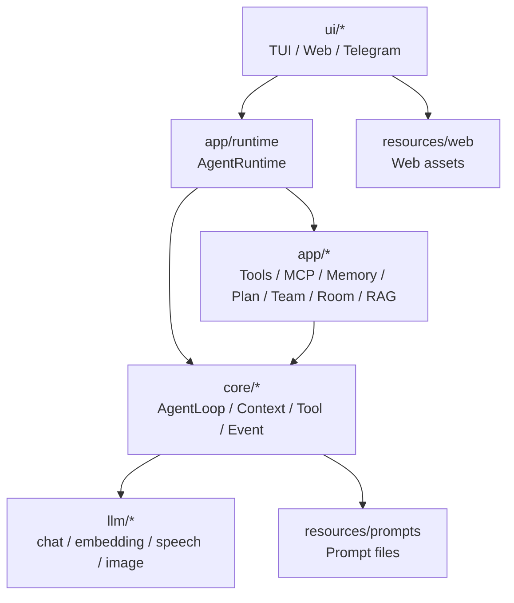

# 项目结构

<!-- AI生成，可根据团队规范更新 -->

## 目录树

```text
Aster/
├── pom.xml                         # Maven 项目配置，Java 21
├── README.md                       # 快速启动和能力概览
├── AGENTS.md                       # Codex 项目入口规则
├── .env.example                    # 本地环境变量示例
├── aster2tui                       # TUI 启动脚本
├── aster2web                       # Web 启动脚本，默认 8081
├── aster2im                        # Telegram IM 启动脚本
├── src/
│   ├── main/
│   │   ├── java/com/aster/
│   │   │   ├── llm/                # 模型能力层：chat / embedding / speech / image
│   │   │   ├── core/               # Agent 主流程和抽象契约
│   │   │   ├── app/                # 具体能力实现和运行时装配
│   │   │   └── ui/                 # TUI / Web / Telegram 入口
│   │   └── resources/
│   │       ├── prompts/            # system、context、memory、plan、team、room、rag prompt
│   │       └── web/                # Web 静态资源
│   └── test/java/com/aster/        # JUnit 5 测试
├── docs/ai-readme/                 # AI + 人类共用项目上下文文档
└── workspace/                      # 运行时数据，本地忽略
```

## 模块职责

| 目录 | 职责 | 关键文件 |
| --- | --- | --- |
| `src/main/java/com/aster/llm/` | 模型能力层；chat 走 OpenAI-compatible SSE，embedding/语音/图片按能力拆接口 | `OpenAiCompatibleChatClient.java`、`OpenAiCompatibleStreamParser.java`、`OpenAiCompatibleProviderFactory.java`、`OllamaProvider.java`、`embedding/EmbeddingClient.java` |
| `src/main/java/com/aster/core/agent/` | Agent 流式主循环和 assistant message 拼接 | `AgentLoop.java`、`AssistantMessageBuilder.java`、`control/AgentRunControl.java` |
| `src/main/java/com/aster/core/context/` | 上下文构建、运行态窗口缓存、LLM/回退摘要、快照模型、工具协议校验 | `ContextWindowCache.java`、`ContextBuilder.java`、`ContextPipeline.java`、`LlmSummarizer.java`、`TranscriptSummarizer.java`、`model/ContextWindowSnapshot.java`、`ToolProtocolValidator.java` |
| `src/main/java/com/aster/core/event/` | Agent 事件总线和事件模型 | `AgentEventBus.java`、`AgentEventHandler.java`、`model/AgentEvent.java` |
| `src/main/java/com/aster/core/hook/` | Hook 扩展点和上下文对象 | `HookRegistry.java`、`AgentHookPoints.java`、`BeforeToolCallContext.java` |
| `src/main/java/com/aster/core/session/` | JSONL Session 存储、索引、回放、消息 seq/hash 记录、上下文窗口写入装饰 | `JsonlSessionStore.java`、`SessionReplayer.java`、`model/SessionMessageRecord.java`、`ContextWindowSessionStore.java`、`SessionIndex.java`、`SessionCatalog.java` |
| `src/main/java/com/aster/core/stage/` | Agent 必经 Stage 流水线 | `LoadSessionMessagesStage.java`、`ContextCompressionStage.java` |
| `src/main/java/com/aster/core/tool/` | Tool 抽象、注册和并发执行 | `ToolRegistry.java`、`ParallelToolExecutor.java`、`LocalToolExecutor.java` |
| `src/main/java/com/aster/app/runtime/` | Runtime 装配、run 调度、Plan 模式协调、上下文快照恢复/保存 | `AgentRuntimeFactory.java`、`AgentRuntime.java`、`AgentRunCoordinator.java`、`PlanModeCoordinator.java`、`ContextWindowSnapshotSessionStore.java`、`JsonContextWindowSnapshotStore.java` |
| `src/main/java/com/aster/app/extension/` | 可选能力注册入口 | `AsterRuntimeExtension.java`、`RuntimeExtensionRegistry.java`、`ToolApprovalExtension.java` |
| `src/main/java/com/aster/app/tool/` | 内置工具、开发者工具、Todo/后台/schedule 工具、结果卸载 | `builtin/BuiltinTools.java`、`developer/DeveloperTools.java`、`result/ToolResultOffloadHook.java` |
| `src/main/java/com/aster/app/hitl/` | 人工审批 | `ToolApprovalHook.java`、`ToolApprovalManager.java` |
| `src/main/java/com/aster/app/background/` | 后台任务、延时提醒、Todo/记忆维护扫描 | `BackgroundTaskScheduler.java`、`BackgroundTaskExecutor.java`、`JsonlBackgroundTaskStore.java` |
| `src/main/java/com/aster/app/schedule/` | 自动化用户消息，到点后提交 user 输入 | `ScheduledUserMessageManager.java`、`ScheduledUserMessageScheduler.java`、`JsonScheduledUserMessageStore.java` |
| `src/main/java/com/aster/app/mcp/` | MCP client/server/transport 适配 | `McpClient.java`、`McpToolAdapter.java`、`transport/StdioMcpTransport.java` |
| `src/main/java/com/aster/app/memory/` | 长期记忆存储和抽取 | `MarkdownMemoryStore.java`、`MemoryExtractionHook.java`、`MemoryExtractionTaskHandler.java` |
| `src/main/java/com/aster/app/plan/` | 动态 DAG Plan 生成和执行 | `PlanPlannerAgent.java`、`PlanRunner.java`、`PlanTaskExecutor.java` |
| `src/main/java/com/aster/app/team/` | 固定 DAG Agent Team | `AgentTeamRunner.java`、`TeamPlanFactory.java`、`TeamAgentFactory.java` |
| `src/main/java/com/aster/app/room/` | Web 多 Agent 聊天室、房间消息、Agent 配置和上下文注入 | `RoomCoordinator.java`、`RoomAgentRunner.java`、`RoomContextInjectHook.java`、`JsonRoomStore.java` |
| `src/main/java/com/aster/app/rag/` | Web Knowledge 知识库问答、文档解析、滑动分块、embedding 入库、向量召回和流式回答 | `RagIngestionService.java`、`RagChatService.java`、`JsonlRagStore.java`、`VectorRetriever.java` |
| `src/main/java/com/aster/ui/tui/` | Lanterna 终端界面 | `TuiMain.java`、`AgentTuiWindow.java`、`command/SlashCommandRegistry.java` |
| `src/main/java/com/aster/ui/web/` | JDK HttpServer Web Chat 和 SSE | `WebMain.java`、`WebServer.java`、`WebAgentEventMapper.java` |
| `src/main/java/com/aster/ui/im/telegram/` | Telegram long polling IM 入口 | `TelegramMain.java`、`TelegramUpdatePoller.java`、`TelegramRuntimeManager.java` |
| `src/main/resources/prompts/` | 外部化 prompt | `agent/system.md`、`plan/planner-system.md`、`team/code-researcher-system.md`、`room/default-agents.json`、`rag/answer-system.md` |
| `src/test/java/com/aster/` | 单元测试和协议测试 | `AgentLoopTest.java`、`PlanPlannerAgentTest.java`、`RoomChatTest.java`、`RagChatServiceTest.java`、`RagRetrieverTest.java` |

## 模块依赖关系



## 运行时数据目录

`workspace/` 是本地运行数据目录，不属于源码模块，默认不提交。

```text
workspace/
├── sessions/                 # JSONL 会话历史和 index.json
├── context-windows/          # 可覆盖上下文窗口快照，恢复压缩进度用
├── tasks/                    # 后台任务定义和运行记录
├── schedules/                # 自动化用户消息定义
├── todos/                    # Web/Agent 共享 Todo 清单
├── skills/                   # 本地 Skill 文档
├── artifacts/tool-results/   # 大工具结果外部卸载
├── memory/                   # 长期记忆 Markdown
├── im/                       # Telegram chat-session 映射
├── rooms/                    # Web Room、members、hub message、Agent 配置和 Agent 私有 session
└── rag/                      # Web Knowledge 知识库、文档、chunk、向量索引和 RAG session
```
