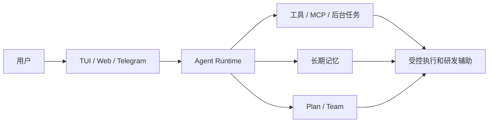

# 业务知识

## 项目背景

<!-- TODO: 一句话描述 Aster 面向谁、解决什么问题、当前教学版和产品版边界。 -->

## 领域术语

| 术语 | 代码名 | 业务含义 |
| --- | --- | --- |
| Agent Runtime | `AgentRuntime` | <!-- TODO: 人工确认 --> |
| Agent 主循环 | `AgentLoop` | <!-- TODO: 人工确认 --> |
| 工具调用 | `ToolCall` / `ToolResult` | <!-- TODO: 人工确认 --> |
| HITL | `ToolApprovalHook` | <!-- TODO: 人工确认 --> |
| 长期记忆 | `MarkdownMemoryStore` | <!-- TODO: 人工确认 --> |
| 后台任务 | `BackgroundTask` | <!-- TODO: 人工确认 --> |
| 动态 Plan | `/plan` | <!-- TODO: 人工确认 --> |
| Agent Team | `/team` | <!-- TODO: 人工确认 --> |

## 核心业务规则

<!-- TODO: 人工补充业务规则，例如哪些工具必须审批、哪些后台任务允许自动执行、哪些记忆类型允许写入。 -->

## 业务关系图

