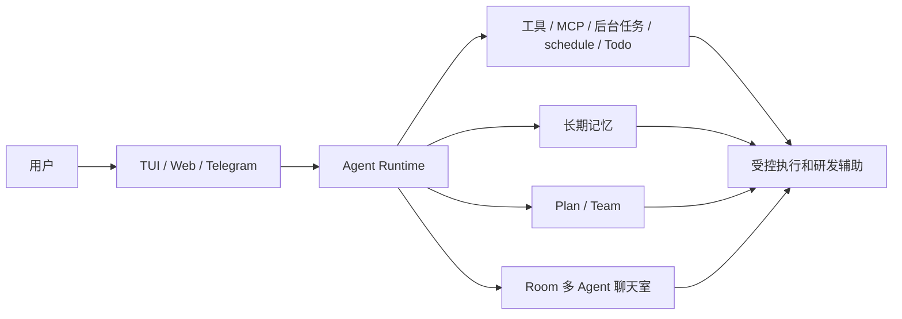

# 业务知识

> 本文档由用户和 AI 共同维护。项目推进中，如果对话里形成了新的业务背景、领域术语、设计边界或规则，应及时补充到这里，避免知识只留在聊天记录里。

## 项目背景

Aster 是一个教学版 Java Agent Runtime 项目，目标是把 LLM Agent 的核心组成拆开演示：流式 LLM、AgentLoop、多轮工具调用、Hook、Event、Session、上下文压缩、长期记忆、后台任务、自动化用户消息 schedule、HITL、Plan、Team、Web/TUI/Telegram 多入口、多 Agent 聊天室、RAG 知识库问答，以及 Web Chat 图片理解。

当前定位不是生产级多租户平台，而是用于学习、演示、面试讲解和持续扩展实验的 MVP。实现优先级是：结构清晰、分层明确、可解释、可运行、少抽象；不要为了“未来可能需要”提前堆复杂框架。

用户偏好的工程风格：

- 先讲清楚改动前后架构、涉及哪些文件，再动代码。
- 尽量复用当前项目已有逻辑，避免大范围重写。
- 扩展能力优先通过 extension、hook、event、tool registry、runtime 装配完成，不鼓励直接修改核心主循环。
- 新增类注释和核心方法注释使用中文。
- 对话中确认的业务规则、架构边界、踩坑经验要沉淀到 `manual/`，而不是只留在聊天记录里。
- 后续涉及 Agent Harness 的设计、实现、踩坑或取舍时，也要评估是否同步更新 `docs/agent-understanding-blog.md`。

## 领域术语

| 术语 | 代码名 | 业务含义 |
| --- | --- | --- |
| Agent Runtime | `AgentRuntime` | UI 入口面对的统一运行时门面，负责暴露 submit、stop、steer、plan、team、room 等高层能力。 |
| Agent 主循环 | `AgentLoop` | 核心编排循环，负责 user 输入、上下文构建、SSE 流式 LLM、工具调用、工具结果写回和最终回答。 |
| 工具调用 | `ToolCall` / `ToolResult` | 模型请求宿主程序执行能力的协议对象；必须保持 assistant tool_calls 与 role=tool 的 tool_call_id 配对。 |
| Hook | `HookRegistry` / `AgentHookPoints` | 运行时扩展点，用于 LLM 请求前注入、工具调用前审批、工具结果写回前改写、运行结束后处理等。 |
| Event | `AgentEventBus` / `AgentEvent` | UI、日志、IM、Web SSE 观察 Agent 运行状态的事件流；Event 只通知，不负责控制。 |
| Extension | `AsterRuntimeExtension` | 注册新工具、新 Hook、新事件处理器的扩展入口；新增能力优先走这里。 |
| HITL | `ToolApprovalHook` / `ToolApprovalManager` | 高影响工具的人类审批机制，当前主要用于 `bash/write/edit` 等可能修改环境的工具。 |
| 长期记忆 | `MarkdownMemoryStore` | Markdown 形式的长期记忆，作为请求前动态提醒注入，不直接混进原始 session 历史。 |
| System Reminder | `<system-reminder>` | 临时注入到最后一条 user 消息开头的运行时提醒块，包含时间、Skill、长期记忆、旧对话摘要等动态内容。 |
| 上下文窗口 | `ContextWindowCache` | 运行态请求窗口，保存旧对话摘要和最近完整 turn，避免每轮 LLM 请求都从 JSONL 全量重建。 |
| 上下文快照 | `ContextWindowSnapshot` | 可覆盖 JSON 缓存，保存上一轮上下文窗口进度；恢复会话时用于跳过已摘要过的历史。 |
| LLM 摘要器 | `LlmSummarizer` | 触发上下文压缩时调用流式 LLM 生成语义摘要，失败时回退转写摘要。 |
| 后台任务 | `BackgroundTask` | 持久化任务定义和执行记录，用于简单提醒、长期记忆抽取、待办扫描等系统后台动作。 |
| 后台扫描器 | `BackgroundTaskScheduler` | 固定间隔扫描后台任务清单，判断 immediate、delay、interval 等后台动作是否到期。 |
| 自动化用户消息 | `ScheduledUserMessage` / `schedule` | 到点后向当前 session 自动提交一条 user 消息，让 Agent 正常进入 AgentLoop 执行。 |
| Todo 便签 | `TodoStore` / `TodoTool` | Web 右侧便签待办和 Agent todo 工具共用的状态清单；第一版用 JSON 保存当前状态。 |
| Schedule 面板 | `ScheduledUserMessageManager` | Web 右侧可视化配置自动化用户消息；和 Agent 的 `schedule` 工具复用同一套 manager/store。 |
| 动态 Plan | `/plan` | 先生成 DAG 计划，展示后等待 `/start` 执行；支持重新计划和取消计划。 |
| Agent Team | `/team` | 固定 DAG 的探索团队，用多个只读子 Agent 并行读代码，再把完整材料交给主 Agent 整理。 |
| 多 Agent 聊天室 | `app/room` | 房间共享消息由用户和 Agent 最终回复组成；每个 Agent 保持独立私有上下文。 |
| Knowledge RAG | `app/rag` | Web 独有知识库问答页；上传文档后解析、分块、embedding、向量召回，再用流式 LLM 回答。 |
| 图片理解 Chat | `app/multimodal` / `llm/multimodal` | Web Chat 上传图片后的独立 SSE 分支，默认使用 Ollama 多模态模型；第一版不进入 AgentLoop、工具协议或普通 Session。 |
| Telegram IM | `ui/im/telegram` | Telegram 入口，映射外部 chat 到本地 session，并把工具状态、后台通知等推送回 IM。 |
| Web UI | `ui/web` | 浏览器入口，提供会话 CRUD、工具审批、Todo、Room 聊天室等交互能力。 |
| TUI | `ui/tui` | 终端入口，消费 AgentEvent 展示运行过程，支持斜杠命令和会话操作。 |

## 入口能力现状

| 能力 | TUI | Web | Telegram IM | 业务说明 |
| --- | --- | --- | --- | --- |
| 普通 Agent 对话 | 已实现 | 已实现 | 已实现 | 三个入口共享 `AgentRuntime.submit()`、AgentLoop、Tool、Hook、Session 主链路。 |
| 流式输出 | 已实现 | 已实现 | 部分实现 | TUI/Web 逐 token 展示；Telegram 为避免刷屏，只在最终事件到来后发送回答。 |
| 图片理解 Chat | 未实现 | 已实现 | 未实现 | Web Chat 上传图片后走 Ollama 多模态 SSE；当前不保存到普通 session，也不开放工具。 |
| 工具过程展示 | 已实现 | 已实现 | 部分实现 | Web 合并工具调用和工具结果并可折叠；Telegram 只推送关键工具状态和必要预览。 |
| HITL 审批 | 已实现 | 已实现 | 已实现 | 高影响工具审批支持单个 id 和不带 id 的批量 approve/deny；Web 额外提供“需要审批 / 默认通过”模式切换。 |
| 运行控制 | 已实现 | 部分实现 | 部分实现 | 三个入口都有 `/stop` 或 Stop；TUI 有 `/steer`，Web 只有 steer API，Telegram 暂无 steer 命令。 |
| Session 管理 | 部分实现 | 已实现 | 部分实现 | Web 最完整；TUI 支持 list/new/use/delete/current；Telegram 支持查看当前 session 和新建。 |
| 多 session 并行运行 | 未实现 | 已实现 | 已实现 | Web 切换 session 不打断旧 session；Telegram 按 chat 维度隔离 runtime。 |
| Todo 便签 | 通过工具可用 | 已实现 | 通过工具可用 | Web 有右侧便签面板；TUI/IM 没有专门 Todo 页面。 |
| Team / Plan | 已实现 | 已实现 | 已实现 | `/team`、`/plan`、`/start` 在三个入口都可触发。 |
| 多 Agent 聊天室 | 未实现 | 已实现 | 未实现 | Room、成员管理、Room Agent CRUD、`@Agent` 触发目前只在 Web 实现。 |
| RAG 知识库问答 | 未实现 | 已实现 | 未实现 | Knowledge 页面支持独立 RAG session、知识库、上传入库、来源展示和流式回答。 |
| 归档中心 | 未实现 | 已实现 | 未实现 | 已归档 session、todo、room、room-agent 的恢复、单个物理删除和批量物理删除目前只在 Web 实现。 |

## 核心业务规则

### 分层规则

- 依赖方向保持 `ui -> app/runtime -> core -> llm`。
- `core` 只放 AgentLoop、Context、Tool、Hook、Event、Session、Stage 等抽象和主流程，不反向依赖 `app`。
- 具体能力放在 `app`，例如内置工具、MCP、Skill、HITL、Memory、Background、Todo、Plan、Team、Room、RAG。
- UI 只调用 `AgentRuntime` 或对应 runtime 门面，并消费事件；不要直接拼装 `AgentLoop`。
- Web/TUI/IM 是不同入口，业务状态尽量通过 runtime、store、event 共享，不要在 UI 层复制核心逻辑。

### 工具与扩展规则

- `read/write/bash/edit` 是固定底座工具。
- `ls/glob/grep/subagent/web_fetch/web_search/load_skill/todo/background_task/schedule` 等新能力优先通过扩展工具注册。
- `bash/write/edit` 属于高影响工具，默认走 HITL 审批。
- 工具失败、审批拒绝、未知工具也要写回合法 `role=tool` 结果，不能破坏 tool_call 协议。
- MCP 工具暴露给 LLM 时统一加 `mcp_` 前缀，例如远端工具 `query-docs` 暴露为 `mcp_query-docs`；实际调用 MCP server 时仍使用原始远端工具名，避免和本地/扩展工具重名。
- Skill 不需要改源码即可注入：把完整 Skill 目录放到 `workspace/skills/<name>/SKILL.md`，重启 runtime 后会扫描 name/description 并注入 `<system-reminder>`；完整内容仍由 `load_skill` 按需读取。
- Team 当前只做只读探索，不注册写工具、bash、todo、background_task、schedule 或 subagent。
- Room Agent 当前只开放只读/检索类工具，不开放 `write/edit/bash/todo/background_task/schedule/subagent`。
- 定时/提醒类需求不要让模型用 `bash sleep` 实现。
- “几分钟后提醒我一句话”这类简单通知用 `background_task` 的 `reminder`。
- “每天 12 点帮我总结新闻”“每周检查项目并回答”这类需要 Agent 到点理解和执行的任务用 `schedule`。

### 上下文与 Session 规则

- `SessionStore` 保存完整原始历史，不保存压缩后的临时上下文。
- 主 runtime 使用 `ContextWindowCache` 保存运行态窗口：旧对话摘要 + 最近完整 user turn；启动时优先恢复 `workspace/context-windows/` 下的 snapshot，快照有效时只读取 JSONL 中 `lastSeq` 之后的消息。
- snapshot 只是可覆盖缓存，不承担审计职责；缺失、损坏、prompt/摘要器变化或 last seq/hash 对不上时，回退到 JSONL 全量重建窗口。
- 主 Chat 模型是每个 `AgentRuntime` 的运行态；切换 `deepseek-v4-flash` / `deepseek-v4-pro` 只影响后续主 Chat 请求，不改变摘要器、session 或 snapshot。
- Team 没有单独指定模型时跟随当前 Chat 模型；如果 `/team --model deepseek-v4-pro ...` 指定模型，则在本次 Team 启动时快照下来，所有子 Agent 使用同一个模型。
- Plan-and-execute 使用固定策略：planner 用 `deepseek-v4-pro` 生成 DAG，worker 用 `deepseek-v4-flash` 执行节点；最终整理仍交给当前主 Chat runtime。
- Room Agent 的模型属于 Agent 配置，可在 Web Agent 设置里选择；旧配置缺失时默认 `deepseek-v4-flash`。
- 上下文压缩优先用 `LlmSummarizer` 调用无工具、无 thinking 的流式 LLM 生成语义摘要，失败或空摘要时回退 `TranscriptSummarizer`。
- 上下文压缩按消息/turn 边界处理，不做字符串硬切。
- 当前时间、Skill 索引、长期记忆、旧对话摘要等动态内容，通过 `<system-reminder>` 注入最后一条 user 消息开头，只参与本轮请求。
- 旧对话压缩的目标语义是“保留最近 3 轮对话 + 最后一次 user + 旧对话摘要”，不要破坏工具调用配对。
- 不要把 steer、长期记忆、压缩摘要随便插成普通 user 历史消息，尤其不能插到 assistant tool_calls 和 role=tool 中间。
- Session 的 `displayName` 只用于展示；JSONL 文件名使用稳定 `sessionId`，建议日期加 uid；删除会话使用 `archived=true`。
- 物理删除只允许已归档对象；普通 session 会删除索引记录和 JSONL，room 会删除房间记录、共享消息和相关 Agent 私有 session，room-agent 会删除配置、prompt 和相关私有 session，todo 会从 JSON 状态中移除。

### Plan 与 Team 规则

- `/team` 是固定 DAG 探索命令，偏“读代码、找线索、收集材料”。
- Team 并行度当前按 3 reader、2 reviewer 的思路设计；reviewer 也可以并行。
- Team 支持按次指定模型：`/team --model deepseek-v4-pro <任务>`；不指定时使用当前 Chat 模型。
- Team 的工具调用很多，UI 不需要展示子 Agent 的每个工具调用，避免事件刷屏。
- Team 不应该探索完就结束，应把完整探索材料交给主 Agent，由主 Agent 进行最终整理。
- `/plan` 是动态 DAG 编排命令，先生成计划并询问，用户 `/start` 后执行；支持重新计划和取消计划。
- Plan 需要解析依赖关系；涉及 `FILE_WRITE`、`COMMAND` 等可能冲突的节点时需要串行或写锁保护。

### Web 与 IM 规则

- Web 普通 Chat 视图展示工具调用和工具结果时，应合并成一个可折叠块，长内容截断。
- Web 普通 Chat 上传图片时走 `/api/vision/chat`，顶部模型下拉临时切到 `OLLAMA_MULTIMODAL_MODEL`；该分支只做流式图片问答，不写普通 Session，不触发工具，也不参与上下文压缩。
- Web 普通 Chat 左侧底部有 `MCP` / `SKILL` 按钮；点击后展开当前 MCP server 加载状态和 Skill 列表。MCP 工具列表可能很长，不逐个展示工具，只展示 server 名称和 loaded/failed 状态。
- Web 空启动不自动创建 `default` session；没有会话时展示引导，用户点击 `+` 或首次发送消息时再创建会话。
- Web 普通 Chat 用 `WebSessionRuntimePool` 管理多个 session 的 `AgentRuntime`；用户切换 B 时，A 可以继续运行，B 也可以继续提交请求。
- Web 普通 Chat 的运行控制请求必须带 `sessionId`；SSE 事件用 `meta.sessionName` 分流，非当前 session 的事件只更新左侧运行状态。
- Web 右侧普通 Chat 视图主要展示 token、context、审批模式、todo、schedule；Room 视图右侧展示 Agent 配置。
- Web 右侧 Todo 和 Schedule 面板的新建表单默认折叠，点击 `+` 展开，保存后自动收起；已有条目也默认折叠，展开后查看完整内容。
- Web 右侧 Schedule 面板可创建每日、一次性和固定间隔自动化用户消息，例如每天固定时间向当前 session 提交“整理长期记忆”。
- Web 工具审批模式有“需要审批”和“默认通过”；“默认通过”是 Web 入口的自动 approve 行为，不改变 TUI/IM 默认安全策略。
- Web Archive 视图集中展示已归档的 session、todo、room、room-agent，并提供恢复、单个物理删除和批量物理删除。
- Web Room 视图隐藏工具调用、工具结果、reasoning，只展示用户消息和 Agent 最终回复。
- Web Room 右侧展示当前聊天室成员；加入/移除成员只影响当前聊天室，不删除全局 Agent。
- Web Knowledge RAG 视图不展示工具调用，因为该链路不给 LLM 开工具；验收重点是来源可见、回答逐 token 流式输出、RAG session 可独立管理。
- Web 顶部模型下拉在普通 Chat 视图切换主 Agent 模型，在 Knowledge 视图切换 RAG chat 模型；RAG 的 chat provider 独立于普通 Agent Chat，第一版默认 DeepSeek chat + Ollama embedding，避免把 Ollama chat 模型名发到 DeepSeek endpoint。
- Web 发送消息时 Enter 发送，Shift+Enter 换行。
- Telegram IM 需要能看到工具调用状态；后台任务完成、提醒、Todo 到期等通知应推送到 IM。
- 服务端口冲突时优先查 `lsof -nP -iTCP:<port> -sTCP:LISTEN`；当前 8080 可能被 nginx 占用，Web 默认使用 8081。

### Room 聊天室规则

- 房间消息是共享 hub message，记录用户消息、Agent 最终回复、系统消息。
- Web 不自动创建默认聊天室；聊天室必须由用户在当前 session 下显式新建。
- 聊天室成员关系由 `workspace/rooms/members.json` 保存，决定当前房间有哪些 Agent 参与。
- 工具调用、工具结果、reasoning、Agent 私有上下文不写入房间共享消息。
- 每个 Room Agent 有自己的 `name`、`role`、外部 system prompt 和私有 JSONL session。
- 每个 Room Agent 有自己的 `model` 配置；模型选择不影响房间共享消息，也不影响其他 Agent 的私有上下文。
- 从某个聊天室移除 Agent 只归档该房间的成员关系；恢复时递增 generation，使用新的私有 session。
- `@all` 只触发当前聊天室未归档成员，不触发全局所有 Agent。
- `@all` 可以并行执行多个 Agent，但写入房间消息时必须按成员 `orderIndex` / `replyIndex` 保持稳定顺序。
- Agent 配置可在 Web 中新增、删除、修改，不写死“产品经理/前端/后端”等角色。
- Room 首次启动时如果没有任何 Agent 记录，会从 `prompts/room/default-agents.json` 导入产品经理、前端、后端、测试、评审、架构师六个示例模板。
- 新加入的 Agent 应能通过房间共享消息理解当前讨论主题。
- Agent 只有被 `@name`、`@alias` 或 `@all` 命中时才回复。
- 采用方案 B：Room Agent 私有上下文保持独立，房间共享消息通过 `RoomContextInjectHook` 临时注入 LLM 请求。

## 对话沉淀规则

- 用户明确确认的产品方向、架构边界和术语解释，应写入本文档。
- AI 在实现过程中发现的稳定规则，如果会影响后续开发，也应写入本文档。
- 涉及代码改动、架构变化、功能新增、入口能力变化或经验沉淀时，交付前要评估 `docs/ai-readme/README.md`、`generated/` 和 `manual/` 是否需要同步更新。
- 不确定的信息不要写成事实；先保留“待沉淀”标记，等用户确认后再固化。
- 如果一次对话只产生“实现细节踩坑”，优先写入 `lessons-learned.md`；如果产生“稳定业务/架构规则”，优先写入本文档。

## 业务关系图

