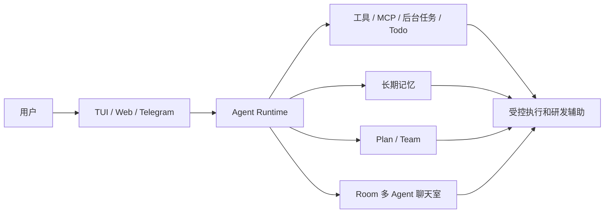

# 业务知识

> 本文档由用户和 AI 共同维护。项目推进中，如果对话里形成了新的业务背景、领域术语、设计边界或规则，应及时补充到这里，避免知识只留在聊天记录里。

## 项目背景

Aster 是一个教学版 Java Agent Runtime 项目，目标是把 LLM Agent 的核心组成拆开演示：流式 LLM、AgentLoop、多轮工具调用、Hook、Event、Session、上下文压缩、长期记忆、后台任务、HITL、Plan、Team、Web/TUI/Telegram 多入口，以及多 Agent 聊天室。

当前定位不是生产级多租户平台，而是用于学习、演示、面试讲解和持续扩展实验的 MVP。实现优先级是：结构清晰、分层明确、可解释、可运行、少抽象；不要为了“未来可能需要”提前堆复杂框架。

用户偏好的工程风格：

- 先讲清楚改动前后架构、涉及哪些文件，再动代码。
- 尽量复用当前项目已有逻辑，避免大范围重写。
- 扩展能力优先通过 extension、hook、event、tool registry、runtime 装配完成，不鼓励直接修改核心主循环。
- 新增类注释和核心方法注释使用中文。
- 对话中确认的业务规则、架构边界、踩坑经验要沉淀到 `manual/`，而不是只留在聊天记录里。

## 领域术语

| 术语 | 代码名 | 业务含义 |
| --- | --- | --- |
| Agent Runtime | `AgentRuntime` | UI 入口面对的统一运行时门面，负责暴露 submit、stop、steer、plan、team、room 等高层能力。 |
| Agent 主循环 | `AgentLoop` | 核心编排循环，负责 user 输入、上下文构建、SSE 流式 LLM、工具调用、工具结果写回和最终回答。 |
| 工具调用 | `ToolCall` / `ToolResult` | 模型请求宿主程序执行能力的协议对象；必须保持 assistant tool_calls 与 role=tool 的 tool_call_id 配对。 |
| Hook | `HookRegistry` / `AgentHookPoints` | 运行时扩展点，用于 LLM 请求前注入、工具调用前审批、工具结果写回前改写、运行结束后处理等。 |
| Event | `AgentEventBus` / `AgentEvent` | UI、日志、IM、Web SSE 观察 Agent 运行状态的事件流；Event 只通知，不负责控制。 |
| Extension | `AsterRuntimeExtension` | 注册新工具、新 Hook、新事件处理器的扩展入口；新增能力优先走这里。 |
| HITL | `ToolApprovalHook` / `ToolApprovalManager` | 高影响工具的人类审批机制，当前主要用于 `bash/write/edit` 等可能修改环境的工具。 |
| 长期记忆 | `MarkdownMemoryStore` | Markdown 形式的长期记忆，作为请求前动态提醒注入，不直接混进原始 session 历史。 |
| System Reminder | `<system-reminder>` | 临时注入到最后一条 user 消息开头的运行时提醒块，包含时间、Skill、长期记忆、旧对话摘要等动态内容。 |
| 后台任务 | `BackgroundTask` | 持久化任务定义和执行记录，用于提醒、长期记忆抽取、待办扫描等异步工作。 |
| 定时任务 | `BackgroundTaskScheduler` | 周期扫描后台任务清单，判断 immediate、delay、interval 等任务是否到期。 |
| Todo 便签 | `TodoStore` / `TodoTool` | Web 右侧便签待办和 Agent todo 工具共用的状态清单；第一版用 JSON 保存当前状态。 |
| 动态 Plan | `/plan` | 先生成 DAG 计划，展示后等待 `/start` 执行；支持重新计划和取消计划。 |
| Agent Team | `/team` | 固定 DAG 的探索团队，用多个只读子 Agent 并行读代码，再把完整材料交给主 Agent 整理。 |
| 多 Agent 聊天室 | `app/room` | 房间共享消息由用户和 Agent 最终回复组成；每个 Agent 保持独立私有上下文。 |
| Telegram IM | `ui/im/telegram` | Telegram 入口，映射外部 chat 到本地 session，并把工具状态、后台通知等推送回 IM。 |
| Web UI | `ui/web` | 浏览器入口，提供会话 CRUD、工具审批、Todo、Room 聊天室等交互能力。 |
| TUI | `ui/tui` | 终端入口，消费 AgentEvent 展示运行过程，支持斜杠命令和会话操作。 |

## 入口能力现状

| 能力 | TUI | Web | Telegram IM | 业务说明 |
| --- | --- | --- | --- | --- |
| 普通 Agent 对话 | 已实现 | 已实现 | 已实现 | 三个入口共享 `AgentRuntime.submit()`、AgentLoop、Tool、Hook、Session 主链路。 |
| 流式输出 | 已实现 | 已实现 | 部分实现 | TUI/Web 逐 token 展示；Telegram 为避免刷屏，只在最终事件到来后发送回答。 |
| 工具过程展示 | 已实现 | 已实现 | 部分实现 | Web 合并工具调用和工具结果并可折叠；Telegram 只推送关键工具状态和必要预览。 |
| HITL 审批 | 已实现 | 已实现 | 已实现 | 高影响工具审批支持单个 id 和不带 id 的批量 approve/deny。 |
| 运行控制 | 已实现 | 部分实现 | 部分实现 | 三个入口都有 `/stop` 或 Stop；TUI 有 `/steer`，Web 只有 steer API，Telegram 暂无 steer 命令。 |
| Session 管理 | 部分实现 | 已实现 | 部分实现 | Web 最完整；TUI 支持 list/new/use/delete/current；Telegram 支持查看当前 session 和新建。 |
| Todo 便签 | 通过工具可用 | 已实现 | 通过工具可用 | Web 有右侧便签面板；TUI/IM 没有专门 Todo 页面。 |
| Team / Plan | 已实现 | 已实现 | 已实现 | `/team`、`/plan`、`/start` 在三个入口都可触发。 |
| 多 Agent 聊天室 | 未实现 | 已实现 | 未实现 | Room、成员管理、Room Agent CRUD、`@Agent` 触发目前只在 Web 实现。 |
| 归档中心 | 未实现 | 已实现 | 未实现 | 已归档 session、todo、room、room-agent 的恢复、单个物理删除和批量物理删除目前只在 Web 实现。 |

## 核心业务规则

### 分层规则

- 依赖方向保持 `ui -> app/runtime -> core -> llm`。
- `core` 只放 AgentLoop、Context、Tool、Hook、Event、Session、Stage 等抽象和主流程，不反向依赖 `app`。
- 具体能力放在 `app`，例如内置工具、MCP、Skill、HITL、Memory、Background、Todo、Plan、Team、Room。
- UI 只调用 `AgentRuntime` 或对应 runtime 门面，并消费事件；不要直接拼装 `AgentLoop`。
- Web/TUI/IM 是不同入口，业务状态尽量通过 runtime、store、event 共享，不要在 UI 层复制核心逻辑。

### 工具与扩展规则

- `read/write/bash/edit` 是固定底座工具。
- `ls/glob/grep/subagent/web_fetch/web_search/load_skill/todo/background_task` 等新能力优先通过扩展工具注册。
- `bash/write/edit` 属于高影响工具，默认走 HITL 审批。
- 工具失败、审批拒绝、未知工具也要写回合法 `role=tool` 结果，不能破坏 tool_call 协议。
- Team 当前只做只读探索，不注册写工具、bash、todo、background_task 或 subagent。
- Room Agent 当前只开放只读/检索类工具，不开放 `write/edit/bash/todo/background_task/subagent`。
- 定时/提醒类需求不要让模型用 `bash sleep` 实现，应通过后台任务和对应 handler 处理。

### 上下文与 Session 规则

- `SessionStore` 保存完整原始历史，不保存压缩后的临时上下文。
- 上下文压缩按消息/turn 边界处理，不做字符串硬切。
- 当前时间、Skill 索引、长期记忆、旧对话摘要等动态内容，通过 `<system-reminder>` 注入最后一条 user 消息开头，只参与本轮请求。
- 旧对话压缩的目标语义是“保留最近 3 轮对话 + 最后一次 user + 旧对话摘要”，不要破坏工具调用配对。
- 不要把 steer、长期记忆、压缩摘要随便插成普通 user 历史消息，尤其不能插到 assistant tool_calls 和 role=tool 中间。
- Session 的 `displayName` 只用于展示；JSONL 文件名使用稳定 `sessionId`，建议日期加 uid；删除会话使用 `archived=true`。
- 物理删除只允许已归档对象；普通 session 会删除索引记录和 JSONL，room 会删除房间记录、共享消息和相关 Agent 私有 session，room-agent 会删除配置、prompt 和相关私有 session，todo 会从 JSON 状态中移除。

### Plan 与 Team 规则

- `/team` 是固定 DAG 探索命令，偏“读代码、找线索、收集材料”。
- Team 并行度当前按 3 reader、2 reviewer 的思路设计；reviewer 也可以并行。
- Team 的工具调用很多，UI 不需要展示子 Agent 的每个工具调用，避免事件刷屏。
- Team 不应该探索完就结束，应把完整探索材料交给主 Agent，由主 Agent 进行最终整理。
- `/plan` 是动态 DAG 编排命令，先生成计划并询问，用户 `/start` 后执行；支持重新计划和取消计划。
- Plan 需要解析依赖关系；涉及 `FILE_WRITE`、`COMMAND` 等可能冲突的节点时需要串行或写锁保护。

### Web 与 IM 规则

- Web 普通 Chat 视图展示工具调用和工具结果时，应合并成一个可折叠块，长内容截断。
- Web 右侧普通 Chat 视图主要展示 token、context、todo；Room 视图右侧展示 Agent 配置。
- Web Archive 视图集中展示已归档的 session、todo、room、room-agent，并提供恢复、单个物理删除和批量物理删除。
- Web Room 视图隐藏工具调用、工具结果、reasoning，只展示用户消息和 Agent 最终回复。
- Web Room 右侧展示当前聊天室成员；加入/移除成员只影响当前聊天室，不删除全局 Agent。
- Web 发送消息时 Enter 发送，Shift+Enter 换行。
- Telegram IM 需要能看到工具调用状态；后台任务完成、提醒、Todo 到期等通知应推送到 IM。
- 服务端口冲突时优先查 `lsof -nP -iTCP:<port> -sTCP:LISTEN`；当前 8080 可能被 nginx 占用，Web 默认使用 8081。

### Room 聊天室规则

- 房间消息是共享 hub message，记录用户消息、Agent 最终回复、系统消息。
- 聊天室成员关系由 `workspace/rooms/members.json` 保存，决定当前房间有哪些 Agent 参与。
- 工具调用、工具结果、reasoning、Agent 私有上下文不写入房间共享消息。
- 每个 Room Agent 有自己的 `name`、`role`、外部 system prompt 和私有 JSONL session。
- 从某个聊天室移除 Agent 只归档该房间的成员关系；恢复时递增 generation，使用新的私有 session。
- `@all` 只触发当前聊天室未归档成员，不触发全局所有 Agent。
- `@all` 可以并行执行多个 Agent，但写入房间消息时必须按成员 `orderIndex` / `replyIndex` 保持稳定顺序。
- Agent 配置可在 Web 中新增、删除、修改，不写死“产品经理/前端/后端”等角色。
- Room 首次启动时如果没有任何 Agent 记录，会从 `prompts/room/default-agents.json` 导入产品经理、前端、后端、测试、评审、架构师六个示例模板。
- 新加入的 Agent 应能通过房间共享消息理解当前讨论主题。
- Agent 只有被 `@name`、`@alias` 或 `@all` 命中时才回复。
- 采用方案 B：Room Agent 私有上下文保持独立，房间共享消息通过 `RoomContextInjectHook` 临时注入 LLM 请求。

## 对话沉淀规则

- 用户明确确认的产品方向、架构边界和术语解释，应写入本文档。
- AI 在实现过程中发现的稳定规则，如果会影响后续开发，也应写入本文档。
- 涉及代码改动、架构变化、功能新增、入口能力变化或经验沉淀时，交付前要评估 `docs/ai-readme/README.md`、`generated/` 和 `manual/` 是否需要同步更新。
- 不确定的信息不要写成事实；先保留“待沉淀”标记，等用户确认后再固化。
- 如果一次对话只产生“实现细节踩坑”，优先写入 `lessons-learned.md`；如果产生“稳定业务/架构规则”，优先写入本文档。

## 业务关系图

