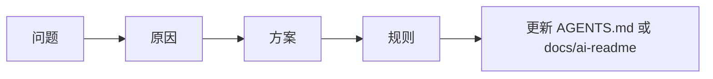

# 历史经验

> AI 与新成员写代码前先看这里，避免重复踩坑。

## 踩坑记录

<!-- TODO: 问题 -> 原因 -> 方案。建议优先补充 tool_call 协议、上下文压缩、HITL、Plan/Team、Web/TUI 渲染相关经验。 -->

| 问题 | 原因 | 方案 | 对应代码 |
| --- | --- | --- | --- |
| <!-- TODO --> | <!-- TODO --> | <!-- TODO --> | <!-- TODO --> |

## 已知风险

<!-- TODO: 人工补充当前项目不希望 AI 自动修改或自动扩展的区域。 -->

## 经验沉淀流程

