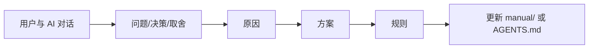

# 历史经验

> 本文档由用户和 AI 共同维护。AI 与新成员写代码前先看这里，避免重复踩坑。

## 踩坑记录

<!-- 待沉淀: 问题 -> 原因 -> 方案。建议优先补充 tool_call 协议、上下文压缩、HITL、Plan/Team、Web/TUI 渲染、Room 多 Agent 聊天相关经验。 -->

| 问题 | 原因 | 方案 | 对应代码 |
| --- | --- | --- | --- |
| Agent 控制功能容易改动过多 | 一开始容易把 stop、steer、follow-up、事件、UI、session 全都揉进 AgentLoop | 控制状态放 core，调度放 app/runtime，输入分流放 ui，状态展示走 event；优先复用现有 AgentLoop 安全点 | `core/agent/control`, `AgentRunCoordinator` |
| steer 不是普通用户消息 | 运行中引导如果写入 session，可能插到 tool_call/tool_result 中间，破坏协议 | steer 通过 LLM 请求前 Hook 临时注入，不写入 session | `SteerExtension`, `BeforeLlmRequestContext` |
| 长期记忆和压缩摘要不应混入 system prompt 或永久历史 | 动态内容如果写进 session 或 system prompt，会污染审计历史，也难以恢复 | 统一放进最后一条 user 消息开头的 `<system-reminder>`，只参与本轮请求 | `SystemReminderInjectHook` |
| tool_call 协议很容易被破坏 | assistant 的 tool_calls 必须紧跟匹配的 role=tool 结果；中间不能插普通 user | 工具失败、审批拒绝、大结果卸载也要写回合法 tool 结果；上下文压缩按消息边界处理 | `AgentLoop`, `ContextBuilder` |
| Web 审批接口曾出现 `java.time.Instant` 序列化错误 | 当前 ObjectMapper 没有注册 `JavaTimeModule` | 对 Web DTO 和持久化状态优先使用 ISO 字符串时间，或显式注册模块；项目里 Todo/Room 使用字符串时间 | `ToolApprovalRequest`, `TodoItem`, `HubMessage` |
| TUI Markdown 表格渲染异常 | 表格宽度、中文字符宽度和换行处理如果按普通字符硬切，边框会错位 | 表格渲染要按列计算宽度，长内容截断/换行，不能只按原始 Markdown 输出 | `ui/tui` Markdown 渲染 |
| Web Enter 发送失效 | textarea 默认 Enter 换行，没有拦截 keydown 提交表单 | Enter 调用 `requestSubmit()`，Shift+Enter 保留换行 | `src/main/resources/web/assets/app.js` |
| Web 工具结果太长撑爆页面 | 工具调用和工具结果分散展示，长结果没有折叠或截断 | 工具调用与结果合成一个块，默认完成后折叠，长内容按行数和字符数截断 | `app.js` tool block |
| LLM 会用 `bash sleep` 实现提醒 | 提示词和长期记忆可能让模型以为定时任务应该靠 shell 等待 | 提醒/定时需求必须有真正的后台任务 handler 和 scheduler；不要暴露 bash 给这类场景 | `BackgroundTaskScheduler`, `ReminderTaskHandler` |
| 定时任务不是只有后台队列 | 只有后台任务工具，没有扫描器和 handler 时，到期后没人执行 | 每 10 秒扫描任务清单，按 trigger 判断是否到期，再交给对应 handler | `app/background` |
| `background_task` 描述不贴合提醒任务会误导模型 | 工具描述偏“后台执行”，模型不知道可以创建提醒/定时扫描 | 工具描述要明确 immediate、delay、interval 和支持的 action 类型 | `BackgroundTaskTool` |
| Telegram IM 看不到 bash 执行内容 | 只展示工具开始/结束，缺少参数和结果摘要 | IM 事件处理要展示工具名、参数摘要、执行耗时和必要输出，但仍要截断长文本 | `ui/im/telegram` |
| HITL 审批要有 call id 但也支持批量 | 用户审批时可能想按单个工具处理，也可能想全部通过/拒绝 | `/approve <id>`、`/deny <id>` 处理单个；不带 id 表示全部处理 | `ToolApprovalManager`, UI/IM commands |
| Team 子 Agent 工具事件太多 | 多个 reader/reviewer 并行 read/grep 会产生大量工具事件，UI 会被刷屏 | Team 只转发成员正文和关键状态，不展示每个工具调用 | `TeamAgentFactory.teamEventBus` |
| Team 探索完不应直接结束 | 用户要的是“主 Agent -> Team -> 主 Agent”，不是 Team 自己给终稿 | Team 完整材料交回主 Agent，由主 Agent 基于材料整理最终回答 | `AgentRuntime.runTeam` |
| Team max tool rounds 过低会过早失败 | 代码探索类任务工具调用次数多，8 轮不够 | Team/Agent 工具轮数调到 100，减少探索中断 | `MAX_TOOL_ROUNDS` |
| Plan 和 Team 容易混淆 | Team 是固定 DAG 探索；Plan 是动态 DAG 编排和执行 | `/team` 做探索；`/plan` 先列 DAG，用户 `/start` 后按依赖执行 | `app/team`, `app/plan` |
| Plan 执行需要依赖解析 | 动态 DAG 里节点有先后依赖和资源冲突，不能简单顺序或全并发 | 解析 dependencies；可并行的节点并行，写文件/命令类节点用锁或串行保护 | `PlanModeCoordinator`, `PlanTaskExecutor` |
| Session 删除不能真删审计文件 | 用户想删除 UI 会话，但项目需要保留 JSONL 审计历史 | Session 删除做 `archived=true`；displayName 和 sessionId 分离 | `SessionIndex`, `SessionRecord` |
| Todo 用 JSON 比 JSONL 更适合 MVP | Web 右侧便签需要直接展示和编辑当前状态，不只是审计事件 | 第一版 Todo 用 JSON 保存当前列表；需要审计时再补事件流 | `JsonTodoStore` |
| 8080 被占用但浏览器还能看到页面 | 本机 8080 可能是 nginx 或旧服务，浏览器页面不代表当前 Java 进程 | 用 `lsof` 查监听进程；Web 默认 8081；旧 screen/java 进程要显式停止 | `aster2web` |
| 关闭浏览器不会停止服务 | Web 服务是独立进程，浏览器 tab 只是客户端 | 用脚本提示、`screen -S ... -X quit` 或 `kill <pid>` 停止服务 | `aster2web`, `aster2im` |
| Room 如果同步等 Agent 回复，用户会以为消息没发出去 | HTTP 请求要等待 LLM 完成，被 @ Agent 多时延迟明显 | 前端先乐观展示用户消息，后端返回后只追加 Agent 回复；后续可改 SSE/WebSocket | `app.js sendRoomMessage` |
| Room 工具限制要保存侧和运行侧都做 | 只在 ToolRegistry 屏蔽，Web 配置里仍显示危险工具会误导用户 | Agent 配置保存时剔除 forbidden tools，运行时再二次过滤 | `JsonRoomAgentRegistry`, `RoomToolRegistryFactory` |
| Room Agent 不能写死角色 | 用户后续不一定做研发主题，可能是任意领域聊天室 | Agent 的 name、role、description、system prompt 都外部配置并可在 Web CRUD | `RoomAgentProfile`, `RoomAgentPromptStore` |
| Room 共享消息不能等同于 Agent 私有上下文 | 后续加入的 Agent 要知道房间消息，但每个 Agent 又要有独立历史 | 房间 hub message 单独 JSONL；Agent 私有 session 单独 JSONL；通过 `RoomContextInjectHook` 临时注入 | `RoomHub`, `RoomAgentSessionFactory`, `RoomContextInjectHook` |
| Room `@all` 并行回复不能按完成时间写入 | 并行 Agent 完成时间不稳定，如果谁先完成谁先写，聊天室顺序每次可能不同 | 成员关系保存 `orderIndex`，本次回复保存 `replyIndex`；并行执行后按顺序统一写回 | `RoomMembership`, `RoomCoordinator` |
| 从聊天室移除 Agent 不等于删除 Agent | 全局 Agent 可复用到多个聊天室，移除只是离开当前房间 | 归档 `roomId + agentId` 成员关系；恢复时 generation + 1，旧私有上下文不再使用 | `RoomMembershipStore`, `RoomAgentSessionFactory` |
| Archive 批量删除必须复用单删校验 | 批量操作更容易绕过“只能删除已归档对象”的约束 | 批量接口只收 `{type,id}` 列表，逐个调用原来的物理删除逻辑 | `WebServer.handleArchives` |
| ai-readme 生成文档会随着代码快速过时 | 功能连续新增后，入口能力、架构图、核心流程可能还停留在旧版本 | 每次涉及代码改动、架构变化、功能新增或经验沉淀，都要评估是否同步 `docs/ai-readme/README.md`、`generated/`、`manual/` | `docs/ai-readme/*`, `AGENTS.md` |

## 已知风险

- 不要为了新增能力直接大改 `AgentLoop`。除非核心协议真的变化，否则优先通过 Hook、Event、Extension、Runtime 装配解决。
- 不要让模型靠 `bash sleep`、shell 脚本或长阻塞命令实现提醒、定时任务、后台任务。
- 不要把动态提醒、长期记忆、旧对话摘要、Room 共享消息写进永久 session 历史。
- 不要把普通 user 消息插到 assistant tool_calls 和 role=tool 结果之间。
- 不要在 Team/Room 子 Agent 中开放写工具、bash、todo、background_task 或 subagent，除非用户明确改变边界。
- Web/IM 展示工具输出时必须截断长文本，避免 UI 被大结果撑爆。
- `workspace/`、`.env`、`.firecrawl/` 是运行数据或本地密钥相关内容，不要提交。
- 提示词外部化后，改代码时也要检查 `src/main/resources/prompts/` 是否需要同步更新。
- `manual/` 是 AI 与人工共同维护文档；实现过程中产生稳定经验时要回写，避免上下文丢失。

## 经验沉淀流程

